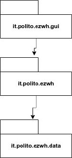
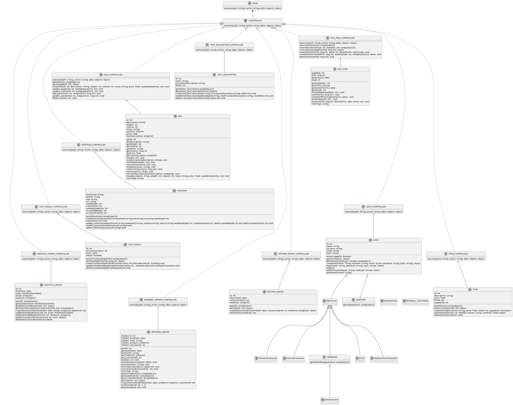
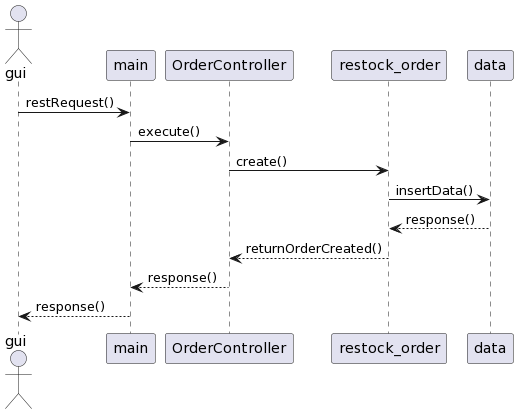
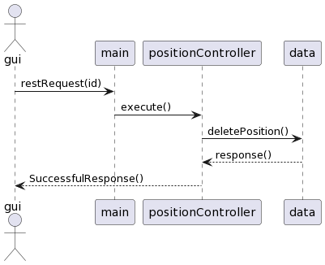
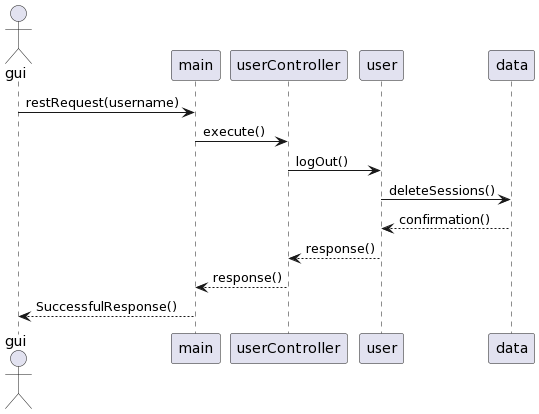
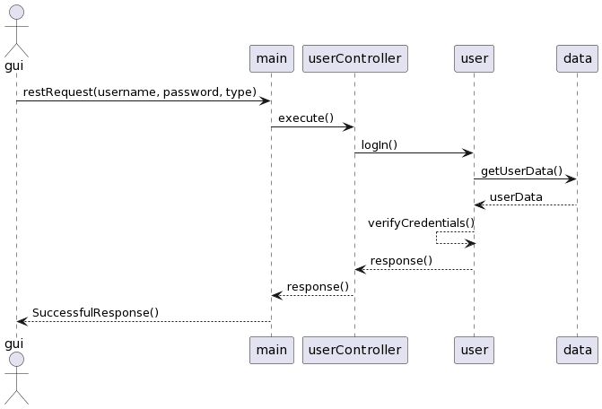

# Design Document

Authors: KEVIN CARDINALE, JUAN ANDRES VANEGAS JADAN, MARCO AMMIRATI, RAMIN HEDAYATMEHR

Date: 27/04/2022

Version: 1.0

# Contents

- [High level design](#package-diagram)
- [Low level design](#class-diagram)
- [Verification traceability matrix](#verification-traceability-matrix)
- [Verification sequence diagrams](#verification-sequence-diagrams)

# Instructions

The design must satisfy the Official Requirements document

# High level design

Ezwh is a three layered application.
* _gui_ (first level): implementation of the graphical user Interface. it corresponds to the "view" of the MVC architecture
* _exwh_ (second level): the logic unit of the system (backend).  it corresponds to the "control" of the MVC architecture
* _data_ (third level): for storing data.  it corresponds to the "model" of the MVC architecture

# Low level design

In order to manage each resource endpoint(Order, SKU, SKUItem, etc), we will implement the command pattern in the main entry point. We will create a Controller interface with a method named ‘execute’ to be implemented in different controllers. We will create one controller for each Resource(‘Order’, ‘SKU’, etc). The main method will call this `execute` method to the controllers depending on the path the requests are done(e.g. If the request is done to /order/*, the main method will call the `execute` method in the OrderController. The specific controller will implement the specific business logic for each resource.

# Verification traceability matrix

|     | Internal order | restock order | return order | internal customer | test descriptor | sku item | test result | supplier | user | warehouse | position | sku | item | customer | Hw_control |
| --- | :------------: | :-----------: | :----------: | :---------------: | :-------------: | :------: | :---------: | :------: | :--: | :-------: | :------: | :-: | :--: | :------: | :--------: |
| FR1 |                |               |              |                   |                 |          |             |          |  x   |           |          |     |      |          |     x      |
| FR2 |                |               |              |                   |                 |    x     |             |          |      |           |          |  x  |      |          |     x      |
| FR3 |                |               |              |                   |        x        |          |      x      |          |      |     x     |    x     |     |      |          |     x      |
| FR4 |                |               |              |         x         |                 |          |             |          |      |           |          |     |      |    x     |     x      |
| FR5 |                |       x       |      x       |                   |                 |    x     |             |    x     |      |           |          |  x  |  x   |    x     |     x      |
| FR6 |       x        |               |              |         x         |                 |    x     |             |          |      |           |          |  x  |  x   |          |     x      |
| FR7 |                |               |              |                   |                 |          |             |          |      |           |          |     |  x   |          |     x      |

# Verification sequence diagrams

## Create restock order

## Delete position

## Logout

## Login

