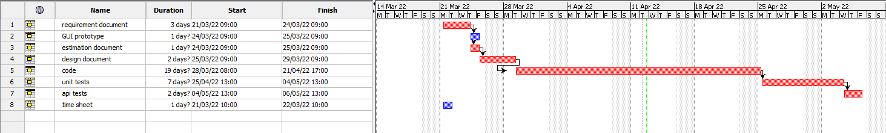

# Project Estimation

Date:

Version:

# Estimation approach

Consider the EZWH project as described in YOUR requirement document, assume that you are going to develop the project INDEPENDENT of the deadlines of the course

# Estimate by size

###

|                                                                                                         | Estimate  |
| ------------------------------------------------------------------------------------------------------- | --------- |
| NC = Estimated number of classes to be developed                                                        | 30        |
| A = Estimated average size per class, in LOC                                                            | 200       |
| S = Estimated size of project, in LOC (= NC \* A)                                                       | 6000      |
| E = Estimated effort, in person hours (here use productivity 10 LOC per person hour)                    | 150       |
| C = Estimated cost, in euro (here use 1 person hour cost = 30 euro)                                     | 4500      |
| Estimated calendar time, in calendar weeks (Assume team of 4 people, 8 hours per day, 5 days per week ) | ~ 4 weeks |

# Estimate by product decomposition

###

| component name       | Estimated effort (person hours) |
| -------------------- | ------------------------------- |
| requirement document | 21                              |
| GUI prototype        | 5                               |
| design document      | 10                              |
| code                 | 150                             |
| unit tests           | 50                              |
| api tests            | 15                              |
| management documents | 15                              |

# Estimate by activity decomposition

###

| Activity name        | Estimated effort (person hours) |
| -------------------- | ------------------------------- |
| requirement document | 21                              |
| GUI prototype        | 5                               |
| Estimation document  | 2                               |
| design document      | 10                              |
| code                 | 150                             |
| unit tests           | 50                              |
| api tests            | 15                              |
| Time sheet           | 2                               |

###

# Summary

Report here the results of the three estimation approaches. The estimates may differ. Discuss here the possible reasons for the difference

|                                    | Estimated effort | Estimated duration |
| ---------------------------------- | ---------------- | ------------------ |
| estimate by size                   | 150 hours        | 4 weeks            |
| estimate by product decomposition  | 266 hours        | 2 weeks            |
| estimate by activity decomposition | 255 hours        | 2 weeks            |
