# Graphical User Interface Prototype  

Authors: KEVIN CARDINALE, JUAN ANDRES VANEGAS JADAN, MARCO AMMIRATI, RAMIN HEDAYATMEHR

Date: 12 april 2022

Version: 1.0

⠀⠀⠀⠀

# Contents

## 1. Login
1. login for a general user

## 2. Log out
1. General log out for a general user

## 3. Registration
1. registration for a general user

## 4. Add internal member
1. Add general internal member of the company

## 5. Handle internal order 
1. create internal order
2. cancel internal oreder
3. modify internal order
4. close internal order

## 6. handle external order 
1. create internal order
2. cancel internal oreder
3. modify internal order
4. close internal order

## 7. Handle supplier profile
1. Modify supplier
2. Delete suppliers
3. view orders
4. view selling status

## 8. Handle warehouse profile
1. Modify warehouse profile
2. Delete warehouse

## 9. Handle supplier inventory 
1. Add item
2. delete item
3. view inventory 

## 10. Handle internal inventory 
1. add item
2. modify item 
3. delete item 
4. view inventory

## 11. Handle new item 
1. check quality (pass)
2. check quality (did not pass)

## 12. Check trust level of a supplier
1. Check trust level of a supplier 

⠀⠀⠀⠀

⠀⠀⠀⠀

# LOGIN
 
### LOGIN FOR A GENERAL USER

- step 1: the user inserts email and password and then clicks on the "Log in" button

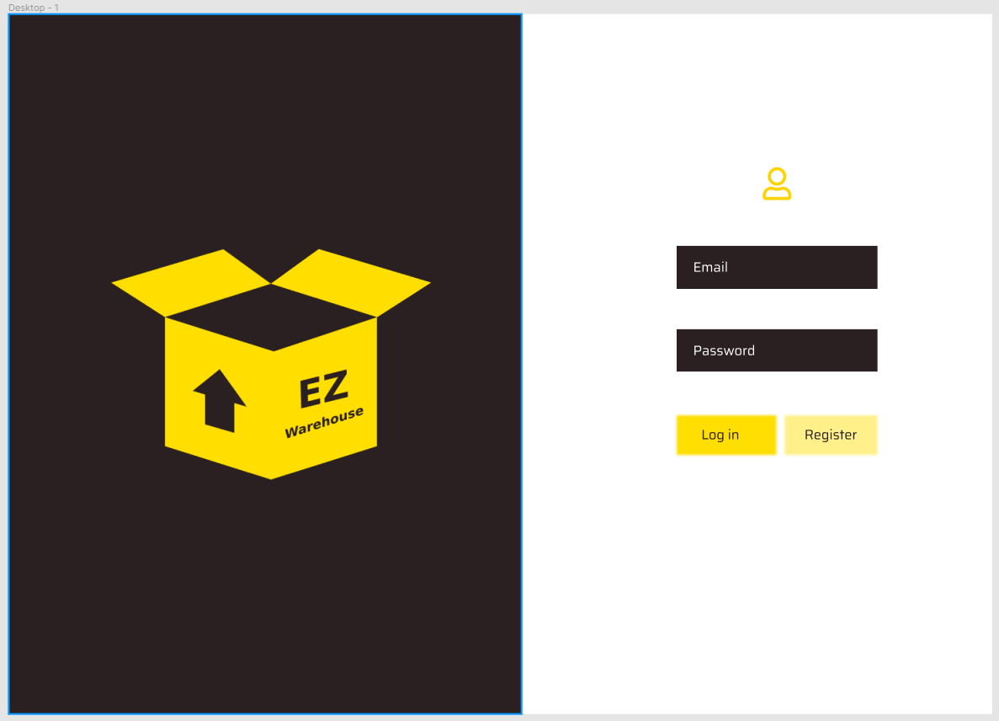

- step 2:  the user will be redirected to the main page relative to the profile

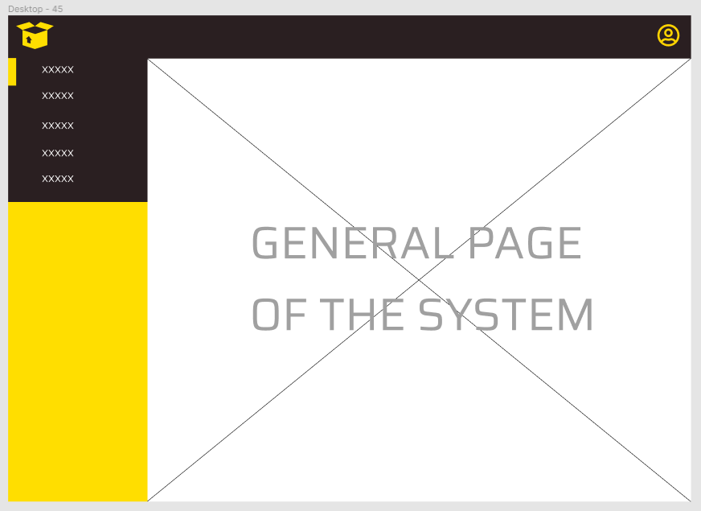

# LOG OUT
 
### LOG OUT FOR A GENERAL USER

- step 1: the user is in a general page

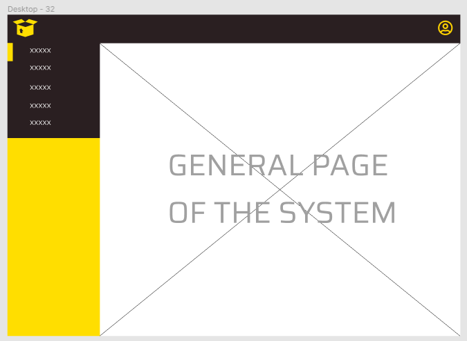

- step 2: the user clicks on the profile symbol on the top right of the page

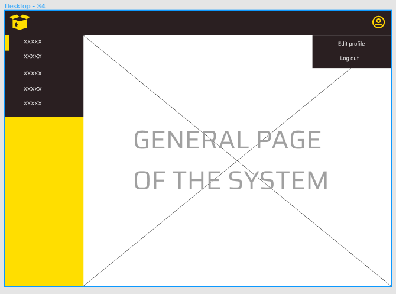

- step 3: the user clicks on the "log out" button and selects the option "yes"

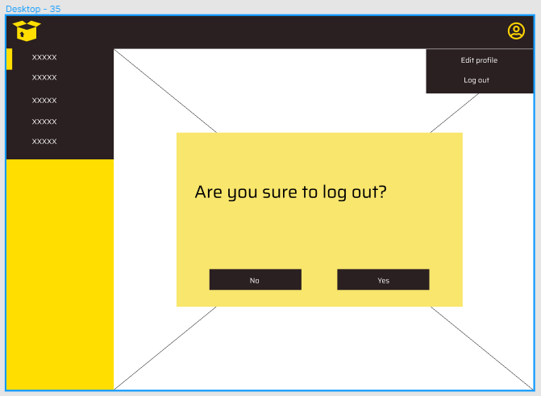

- step 4: the user is redirected to the login page

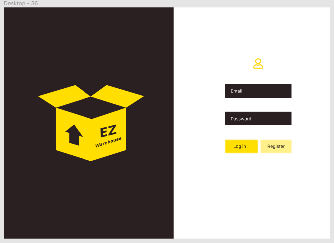

# REGISTRATION
 
### LOG OUT FOR A GENERAL USER

- step 1: the user is the login page and clicks on the "register" button

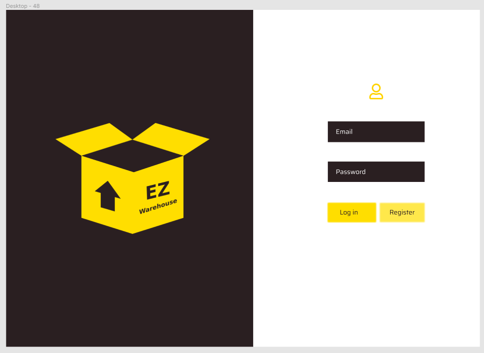

- step 2: the user fills all the required fields and clicks of the "confirm" button

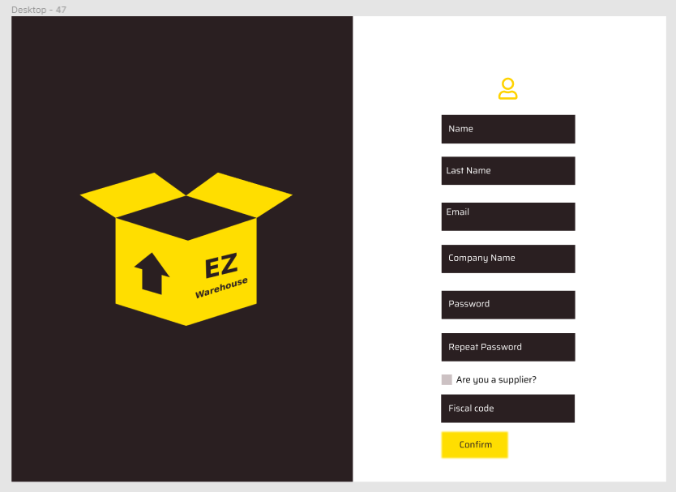

- step 3: the is redirected to the main page 

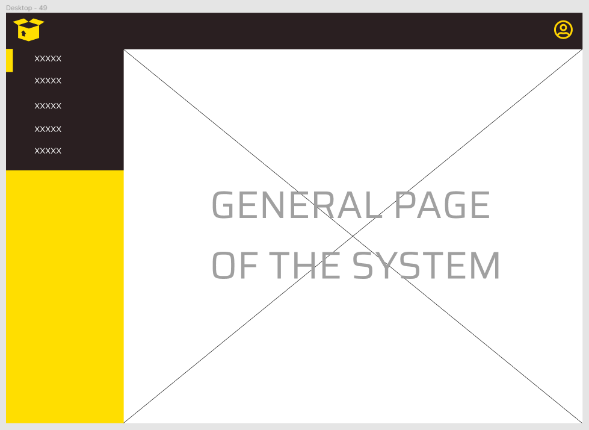

# ADD INTERNAL MEMBER 
 
### ADD GENERAL INTERNAL MEMEBER OF THE COMPANY

- step 1: the warehouse manager clicks on the user section on the left bar and clicks on "add new user" on the top right

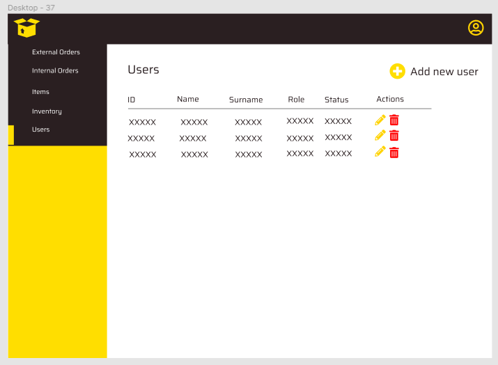

- step 2: the warehouse manager fills all the required fields 

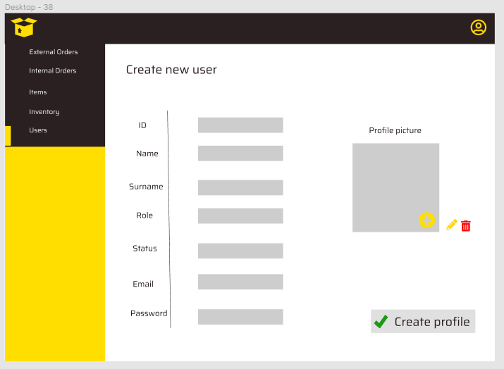

- step 3: the warehouse manager clicks on "yes"

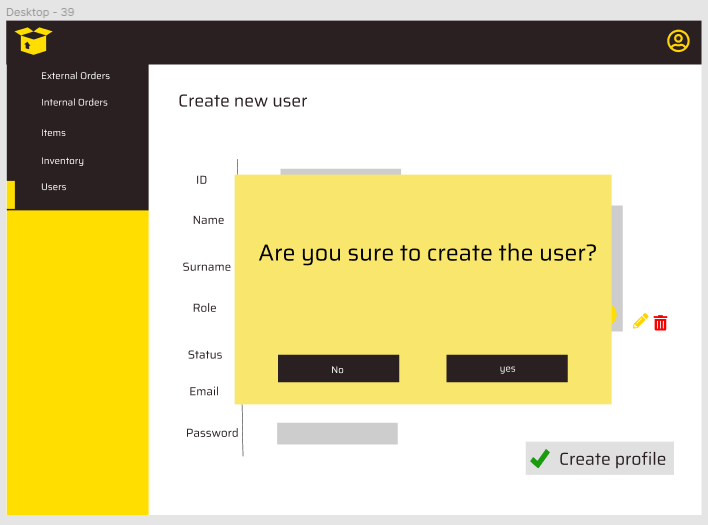

- step 4: the system shows a confirmation pop up and the warehouse manager clicks on "yes"

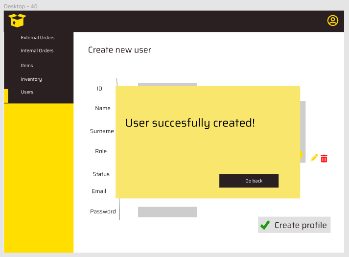

- step 5: the warehouse manager is redirected to the users page

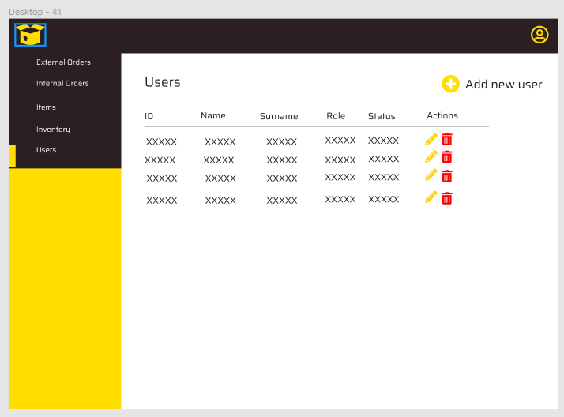

# HANDLE INTERNAL ORDER
 
### CREATE INTERNAL ORDER

- step 1: the internal order manager clicks on the orders button and on the "new order" button

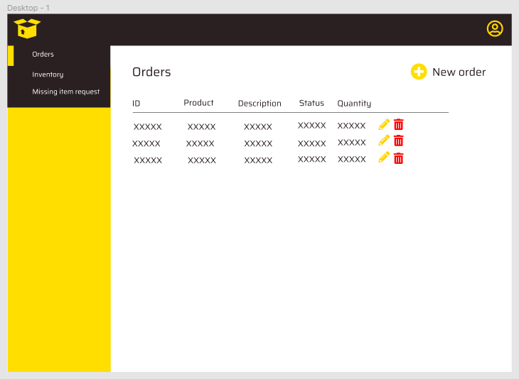

- step 2: the internal order manager selects the quantity for each required item and clicks on "place order"

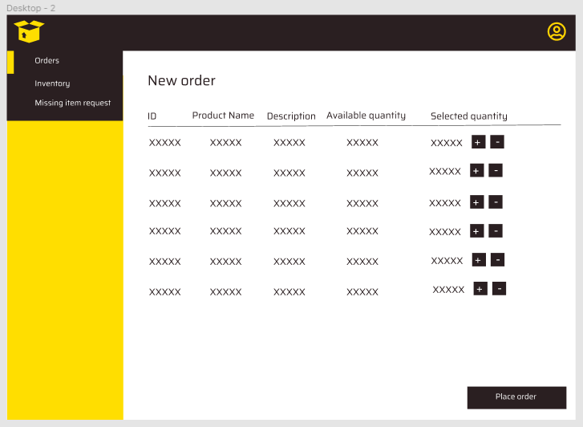

- step 3: the system shows a confirmation box

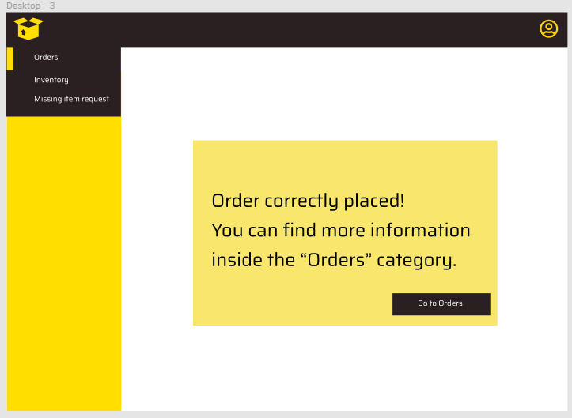

### CANCEL INTERNAL ORDER

- step 1: the internal order manager is in the order page and selects the correspondent "red bin" button 

- step 2: the system shows a confirmation message and the internal order manager clicks on "yes"

- step 3: the system shows a confirmation message

### MODIFY INTERNAL ORDER

- step 1: the internal order manager is inside the orders page and clicks on the yellow pencil button

- step 2: the internal order manager modify the quantity for each item of the order and selecs which item remove. then clicks on the "confirm edit" button

- step 3: the system shows a confirmation box and the internal order manager clicks on yes

- step 4: the system shows a confirmation message

### CLOSE INTERNAL ORDER

- step 1: the internal order manager is the order page and clicks on the green "V" button to confirm the delivery

- step 2: the system shows a confirmation message and the internal order manager clicks on the "yes" button

- step 3: the system shows a confirmation pop up and redirects the internal order manager in the order page.

### CREATE EXTERNAL ORDER

- step 1: the warehouse manager is in the order page and clicks on the "new order" button on the top right of the page

- step 2: the warehouse manager selects the required item and the quantity

- step 3: the system shows all the supplier with a compatible number of quantity and then the warehouse manager select the preferred supplier

- step 4: the system shows a summary of the order and the warehouse manager clicks on the "pay" button

- step 5: the warehouse manager fills all the required fields and clicks on the "confirm" button

- step 6: the system shows a confirmation message to confirm the operation and the warehouse manager clicks on the "yes" button

- step 7:  the system shows a confirmation message and the warehouse manager clicks on the "go to orders" button

### CANCEL EXTERNAL ORDER

- step 1: the warehouse manager is in the external order page and select the red "bin" button to cancel an order

- step 2: the system asks for a confirmation and the warehouse manager selects "yes"

- step 3: the system shows a confirmation message

### MODIFY EXTERNAL ORDER

- step 1: the warehouse manager is in the external order page and select the yellow "pencil" button to modify a specific order

- step 2: the system asks for the new quantity, if the items have to be removed, the system compute the new total and then the warehouse manger clicks on the "confirm edit" button

- step 3: the system asks for a confirmation and the warehouse manager clicks on the "yes" button

- step 4: the system shows a confirmation message

### CLOSE EXTERNAL ORDER

- step 1: the warehouse manager is in the external order page and select the green "V" button to confirm the delivery

- step 2: the system asks for confirmation from the warehouse manager and the warehouse manager clicks on the "yes" button

- step 3: the system shows a confirmation message

