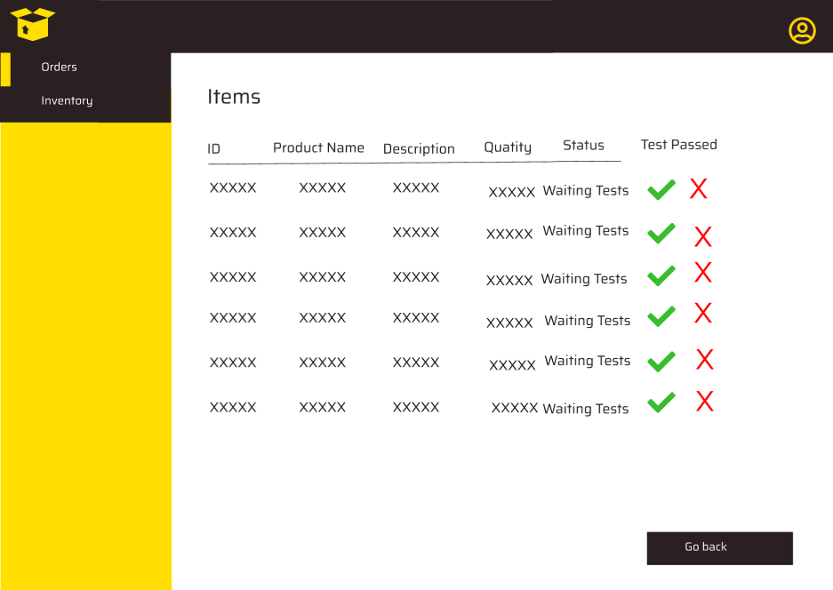
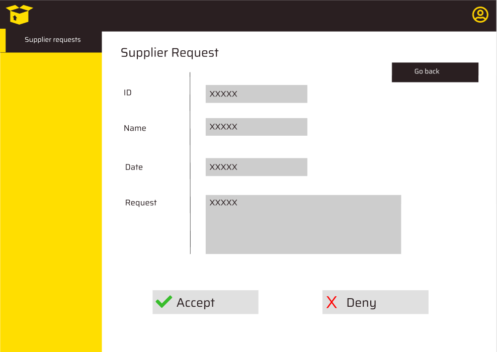

# Graphical User Interface Prototype  

Authors: KEVIN CARDINALE, JUAN ANDRES VANEGAS JADAN, MARCO AMMIRATI, RAMIN HEDAYATMEHR

Date: 12 april 2022

Version: 1.0

⠀⠀⠀⠀

# Contents

## 1. Login
1. login for a general user

## 2. Log out
1. Log out for a general user

## 3. Registration
1. registration for a general user

## 4. Add internal member
1. Add general internal member of the company

## 5. Handle internal order 
1. create internal order
2. cancel internal oreder
3. modify internal order
4. close internal order

## 6. handle external order 
1. create internal order
2. cancel internal oreder
3. modify internal order
4. close internal order

## 7. Handle supplier profile
1. Modify supplier
2. Delete suppliers
3. view orders
4. view selling status

## 8. Handle warehouse profile
1. Modify warehouse profile
2. Delete warehouse

## 9. Handle supplier inventory 
1. Add item
2. delete item
3. view inventory 

## 10. Handle internal inventory 
1. add item
2. modify item 
3. delete item 
4. view inventory

## 11. Handle new item 
1. check quality (pass)
2. check quality (did not pass)

## 12. Check trust level of a supplier
1. Check trust level of a supplier 

⠀⠀⠀⠀

⠀⠀⠀⠀

# 1 LOGIN
 
### LOGIN FOR A GENERAL USER

- step 1: the user inserts email and password and then clicks on the "Log in" button

- step 2:  the user will be redirected to the main page relative to the profile

# 2 LOG OUT
 
### LOG OUT FOR A GENERAL USER

- step 1: the user is in a general page

- step 2: the user clicks on the profile symbol on the top right of the page

- step 3: the user clicks on the "log out" button and selects the option "yes"

- step 4: the user is redirected to the login page

# 3 REGISTRATION
 
### LOG OUT FOR A GENERAL USER

- step 1: the user is the login page and clicks on the "register" button

- step 2: the user fills all the required fields and clicks of the "confirm" button

- step 3: the is redirected to the main page 

# 4 ADD INTERNAL MEMBER 
 
### ADD GENERAL INTERNAL MEMEBER OF THE COMPANY

- step 1: the warehouse manager clicks on the user section on the left bar and clicks on "add new user" on the top right

- step 2: the warehouse manager fills all the required fields 

- step 3: the warehouse manager clicks on "yes"

- step 4: the system shows a confirmation pop up and the warehouse manager clicks on "go back"

- step 5: the warehouse manager is redirected to the users page

# 5 HANDLE INTERNAL ORDER
 
### CREATE INTERNAL ORDER

- step 1: the internal order manager clicks on the orders button and on the "new order" button

- step 2: the internal order manager selects the quantity for each required item and clicks on "place order"

- step 3: the system shows a confirmation box

### CANCEL INTERNAL ORDER

- step 1: the internal order manager is in the order page and selects the correspondent "red bin" button 

- step 2: the system shows a confirmation message and the internal order manager clicks on "yes"

- step 3: the system shows a confirmation message

### MODIFY INTERNAL ORDER

- step 1: the internal order manager is inside the orders page and clicks on the yellow pencil button

- step 2: the internal order manager modify the quantity for each item of the order and selecs which item remove. then clicks on the "confirm edit" button

- step 3: the system shows a confirmation box and the internal order manager clicks on yes

- step 4: the system shows a confirmation message

### CLOSE INTERNAL ORDER

- step 1: the internal order manager is the order page and clicks on the green "V" button to confirm the delivery

- step 2: the system shows a confirmation message and the internal order manager clicks on the "yes" button

- step 3: the system shows a confirmation pop up and redirects the internal order manager in the order page.

# 6 HANDLE EXTENAL ORDER

### CREATE EXTERNAL ORDER

- step 1: the warehouse manager is in the order page and clicks on the "new order" button on the top right of the page

- step 2: the warehouse manager selects the required item and the quantity

- step 3: the system shows all the supplier with a compatible number of quantity and then the warehouse manager select the preferred supplier

- step 4: the system shows a summary of the order and the warehouse manager clicks on the "pay" button

- step 5: the warehouse manager fills all the required fields and clicks on the "confirm" button

- step 6: the system shows a confirmation message to confirm the operation and the warehouse manager clicks on the "yes" button

- step 7:  the system shows a confirmation message and the warehouse manager clicks on the "go to orders" button

### CANCEL EXTERNAL ORDER

- step 1: the warehouse manager is in the external order page and select the red "bin" button to cancel an order

- step 2: the system asks for a confirmation and the warehouse manager selects "yes"

- step 3: the system shows a confirmation message

### MODIFY EXTERNAL ORDER

- step 1: the warehouse manager is in the external order page and select the yellow "pencil" button to modify a specific order

- step 2: the system asks for the new quantity, if the items have to be removed, the system compute the new total and then the warehouse manger clicks on the "confirm edit" button

- step 3: the system asks for a confirmation and the warehouse manager clicks on the "yes" button

- step 4: the system shows a confirmation message

### CLOSE EXTERNAL ORDER

- step 1: the warehouse manager is in the external order page and select the green "V" button to confirm the delivery

- step 2: the system asks for confirmation from the warehouse manager and the warehouse manager clicks on the "yes" button

- step 3: the system shows a confirmation message

# 7 HANDLE SUPPLIER PROFILE

### MODIFY SUPPLIER supplier

- step 1: the supplier is in a general page 

- step 2: the supplier click on the top right profile icon

- step 3: the system redirects the the supplier to the profile page and the supplier edits some informations. then clicks on "confirm edits"

- step 4: the system redirects the supplier in a general page of the system

### DELETE SUPPLIERS

- step 1: the supplier is in a general page 

- step 2: the supplier click on the top right profile icon

- step 3: the system redirects the supplier into the profile page. then the supplier clicks on "show advanced configuration"

- step 4:  the supplier clicks on "delete account"

- step 5: the system shows a confirmation pop up and the supplier clicks on "yes"

- step 6: the system redirects the user to the login page

### VIEW ORDERS

- step 1: the system shows all the pending orders

### VIEW SELLING STATUS

- step 1: in the profile section, the supplier can see the decision made by the administrator after the supplier's registration

# 8 HANDLE WAREHOUSE PROFILE

### MODIFY WAREHOUSE PROFILE

- step 1: the warehouse manager is in a general page of the system

- step 2: the warehouse manager clicks on the top right profile icon and then clicks on "edit profile"

- step 3: the warehouse manager edits some information

- step 4: the warehouse manager clicks on the "confirm edits" button

### DELETE WAREHOUSE

- step 1: the warehouse manage is in a general page of the system

- step 2: the warehouse manager clicks on the profile button on the top right part of the page and then clicks on "edit profile"

- step 3: the system redirects the warehosue manager to the profile section and the warehouse manager clicks on "show advanced configuration"

- step 4: the system shows a delete button and the warehouse manager clicks on it

- step 5: the system shows a confirmation message and the warehouse manager clicks on "yes"

- step 6: the system redirects the user to the login page

# 9 HANDLE SUPPLIER INVENTORY

### ADD ITEM

- step 1: the supplier is in the inventory page and clicks on the "add new item" button

- step 2: the system redirects the supplier to a specific page and the supplier fills all the required fields. then clicks on add

- step 3: in case of errors (db constraints for example) the system shows the error

### DELETE ITEM

- step 1: the supplier, in the inventory page, clicks on the red "bin" button and the system shows a confirmation message. then the supplier clicks on "yes"

### VIEW INVENTORY

- step 1: the supplier in a general page of the system clicks on the "Inventory" button. then the system shows all the items in the inventory

# 10 HANDLE INTERNAL INVENTORY

### ADD ITEM

- step 1: the warehouse manager sees the items in the warehouse. He clicks on "add new item" button.

- step 2: the warehouse manager fills the fields and press the add button to insert the new item.

- step 3: in case the warehouse manager inserts an invalid item an error message appears.

### MODIFY ITEM

- step 1: the warehouse manager sees the items in the warehouse. He clicks on one item to modify it.

- step 2: the warehouse manager can modify the fields of the selected item and click on the "modify" button to update the informations of the item.

- step 3: in case the warehouse manager clicks on the "go back" button without having previously saved the changes, a warning message appears.

- step 4: in case the warehouse manager modifies the selected item with invalid fields, an error message appears.

### DELETE ITEM

- step 1: the warehouse manager , in the inventory page, clicks on the red "bin" button and the system shows a confirmation message. then the supplier clicks on "yes"

### VIEW INVENTORY

- step 1: the warehouse manager sees the items in the warehouse.

# 11 HANDLE NEW ITEM

### CHECK QUALITY (PASS)

- step 1: the quality examiner sees the orders. He can see the items of the order by clicking on it.

- step 2: the quality examiner click on the green "V" because an item passed the quality check.

- step 3: a safety message appears. The quality examiner can confirm the choice or not.

- step 4: the status of the selected item is updated.

### CHECK QUALITY (DID NOT PASS)

- step 1: the quality examiner sees the orders. He can see the items of the order by clicking on it.

- step 2: the quality examiner click on the X button because an item didn't pass the quality check.

- step 3: a safety message appears. The quality examiner can confirm the choice or not.

- step 4: the status of the selected item is updated.

- step 5: the status of the order is marked as "conflicts found"

# 12 CHECK TRUST LEVEL OF A SUPPLIER
 
### CHECK TRUST LEVEL OF A SUPPLIER

- step 1: the administrator sees the list of requests from suppliers, he can click on the plus button to see more details

- step 2: the administrator sees the details of the request, he can accept or deny the request or go back to the previous window.

- step 3: a safety message appears. The administrator can confirm the choice or not.

- step 4: a safety message appears. The administrator can confirm the choice or not.

