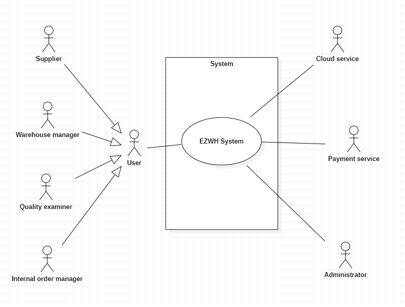
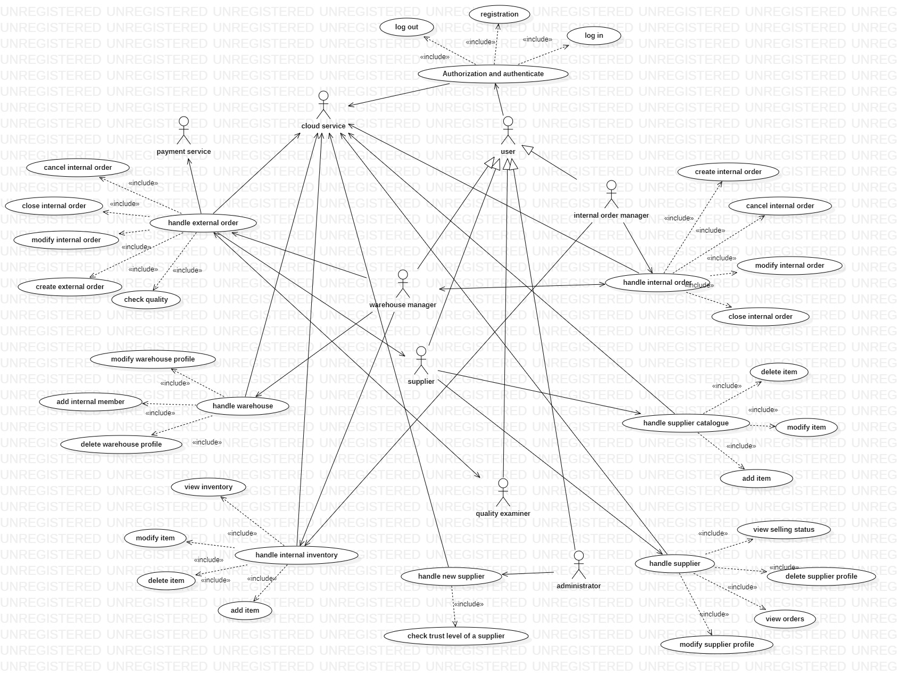
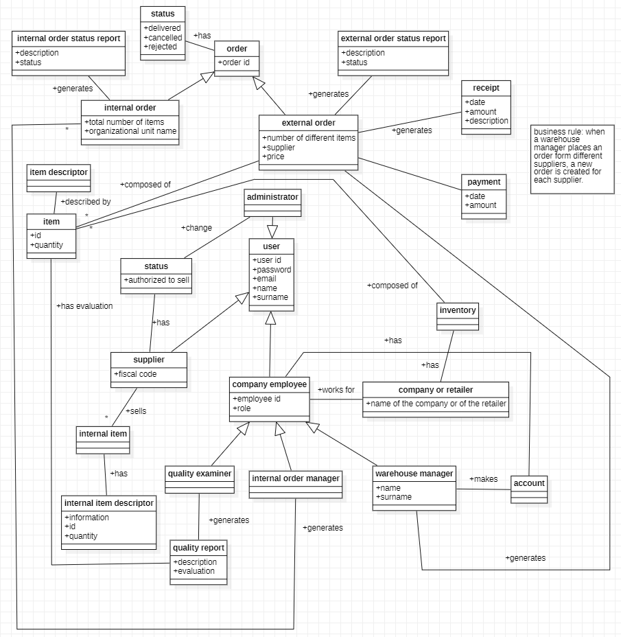
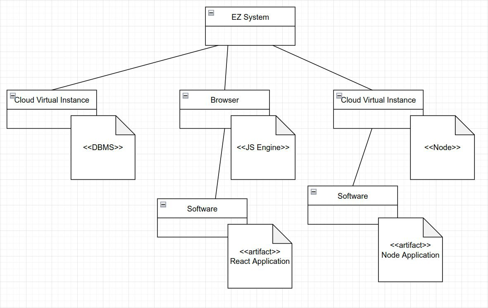
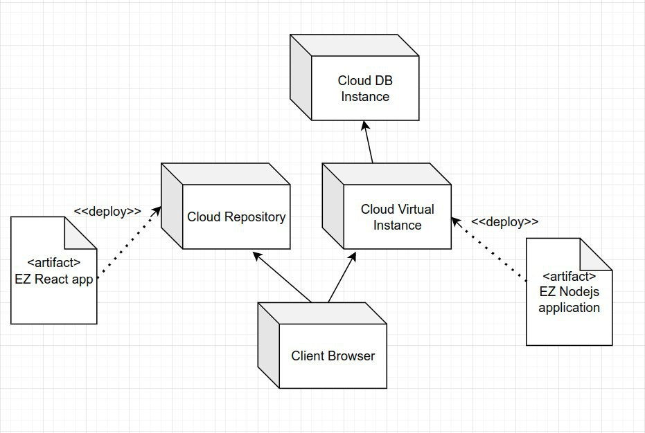

#Requirements Document

Date: 12 april 2022

Version: 1.0

| Version number | Change                      |
| -------------- | :-------------------------- |
| 0.1            | added stakeholders, stories |
| 0.2            | functional requirements     |
| 0.3            | added some functionalities  |
| 1.0            | initial complete release    |

# Contents

- [Informal description](#informal-description)
- [Stakeholders](#stakeholders)
- [Context Diagram and interfaces](#context-diagram-and-interfaces)
  - [Context Diagram](#context-diagram)
  - [Interfaces](#interfaces)
- [Stories and personas](#stories-and-personas)
- [Functional and non functional requirements](#functional-and-non-functional-requirements)
  - [Functional Requirements](#functional-requirements)
  - [Non functional requirements](#non-functional-requirements)
- [Use case diagram and use cases](#use-case-diagram-and-use-cases)
  - [Use case diagram](#use-case-diagram)
  - [Use cases](#use-cases) + [Relevant scenarios](#relevant-scenarios)
- [Glossary](#glossary)
- [System design](#system-design)
- [Deployment diagram](#deployment-diagram)

# Informal description

Medium companies and retailers need a simple application to manage the relationship with suppliers and the inventory of physical items stocked in a physical warehouse.
The warehouse is supervised by a manager, who supervises the availability of items. When a certain item is in short supply, the manager issues an order to a supplier.
In general the same item can be purchased from many suppliers. The warehouse keeps a list of possible suppliers per item.

After some time the items ordered to a supplier are received. The items must be quality checked and stored in specific positions in the warehouse.
The quality check is performed by specific roles (quality office), who apply specific tests for item (different items are tested differently).
Possibly the tests are not made at all, or made randomly on some of the items received. If an item does not pass a quality test it may be
rejected and sent back to the supplier.

Storage of items in the warehouse must take into account the availability of physical space in the warehouse. Further the position of items must be traced to
guide later recollection of them.

The warehouse is part of a company. Other organizational units (OU) of the company may ask for items in the warehouse. This is implemented via internal orders,
received by the warehouse. Upon reception of an internal order the warehouse must collect the requested item(s), prepare them and deliver them to a pick up area.
When the item is collected by the other OU the internal order is completed.

EZWH (EaSy WareHouse) is a software application to support the management of a warehouse.

# Stakeholders

| Stakeholder name       | Description                                                                                                                      |
| ---------------------- | :------------------------------------------------------------------------------------------------------------------------------- |
| supplier               | who supplies products to retailers or companies                                                                                  |
| customer company       | company that needs a product                                                                                                     |
| warehouse manager      | manager of the warehouse of a company or of a retailer                                                                           |
| quality examiner       | person(s) in charge of testing the quality of the products to admit them into the warehouse                                      |
| competitors            | similar systems/software application having the same goal                                                                        |
| organizational units   | organizational units of the company                                                                                              |
| cloud service          | cloud service to host the software                                                                                               |
| internal order manager | who has the task to manage interal order inside the company: there is a one internal order manager for each organizational units |
| payment service        | service (or services) used to pay                                                                                                |
| administrator          | the person in charge of the verification phase for the suppliers                                                                 |

# Context Diagram and interfaces

## Context Diagram

## Interfaces

| Actor                  |           Logical Interface           | Physical Interface       |
| ---------------------- | :-----------------------------------: | :----------------------- |
| administrator          | screen, keyboard, internet connection | graphical user interface |
| warehouse manager      | screen, keyboard, internet connection | graphical user interface |
| quality examiner       | screen, keyboard, internet connection | graphical user interface |
| internal order manager | screen, keyboard, internet connection | graphical user interface |
| supplier               | screen, keyboard, internet connection | graphical user interface |
| payment service        |          Internet connection          | API                      |
| cloud service          |          Internet connection          | API, GUI                 |

# Stories and personas

- persona 1: medium company, 10 years of experience
  - story: a company composed of different organizational units needs a system to efficiently buy different products and also manage its own inventory.
- persona 2: small retailer of a small city
  - story: a retailer needs a system to buy in stock different products to resale
- persona 3: supplier working with a large number of compaies among the country
  - story: supplier needs a system to sell its product to companies and retailers.

# Functional and non functional requirements

## Functional Requirements

| ID        |           Description           |
| --------- | :-----------------------------: |
| FR1       | Authorization and authenticate  |
| ⠀⠀⠀⠀FR1.1 |             Log in              |
| ⠀⠀⠀⠀FR1.2 |             Log out             |
| ⠀⠀⠀⠀FR1.3 |          Registration           |
|           |                                 |
| FR2       |      Handle internal order      |
| ⠀⠀⠀⠀FR2.1 |      Create internal order      |
| ⠀⠀⠀⠀FR2.2 |      Cancel internal order      |
| ⠀⠀⠀⠀FR2.3 |      Modify internal order      |
| ⠀⠀⠀⠀FR2.4 |      Close internal order       |
|           |                                 |
| FR3       |      Handle external order      |
| ⠀⠀⠀⠀FR3.1 |      Create external order      |
| ⠀⠀⠀⠀FR3.2 |      Cancel external order      |
| ⠀⠀⠀⠀FR3.3 |      Modify external order      |
| ⠀⠀⠀⠀FR3.4 |      Close external order       |
| ⠀⠀⠀⠀FR3.5 |          Check quality          |
|           |                                 |
| FR4       |        Handle warehouse         |
| ⠀⠀⠀⠀FR4.1 |    Modify warehouse profile     |
| ⠀⠀⠀⠀FR4.2 |    Delete warehouse profile     |
| ⠀⠀⠀⠀FR4.3 |       Add internal member       |
|           |                                 |
| FR5       |    Handle internal inventory    |
| ⠀⠀⠀⠀FR5.1 |            add item             |
| ⠀⠀⠀⠀FR5.2 |           delete item           |
| ⠀⠀⠀⠀FR5.3 |           modify item           |
| ⠀⠀⠀⠀FR5.4 |         View inventory          |
|           |                                 |
| FR6      |         Handle supplier          |
| ⠀⠀⠀⠀FR6.1 |     Modify supplier profile     |
| ⠀⠀⠀⠀FR6.2 |     Delete supplier profile     |
| ⠀⠀⠀⠀FR6.3 |           view orders           |
| ⠀⠀⠀⠀FR6.4 |       view selling status       |
|           |                                 |
| FR7       |    Handle supplier catalogue    |
| ⠀⠀⠀⠀FR7.1 |            Add item             |
| ⠀⠀⠀⠀FR7.2 |           Modify item           |
| ⠀⠀⠀⠀FR7.3 |           Delete item           |
|           |                                 |
| FR8       |       Handle new supplier       |
| ⠀⠀⠀⠀FR8.1 | check trust level of a supplier |

## Non Functional Requirements

| ID   |    Type     |        Description         |        Refers to |
| ---- | :---------: | :------------------------: | ---------------: |
| NFR1 | Reliability |     < 2 crash per year     | the whole system |
| NFR2 |  Usability  |    < 1 hour of training    | the whole system |
| NFR3 | Performance | < 0.1 sec of responce time | the whole system |
| NFR4 | Portability |  among different browser   | the whole system |
| NFR5 |  Security   |       no leaked data       | the whole system |

# Use case diagram and use cases

## Use case diagram

### Use case 1, REGISTRATION

| Actors Involved  |     warehouse manager, supplier, cloud service     |
| ---------------- | :------------------------------------------------: |
| Precondition     | the user is not already registered to the platform |
| Post condition   |       the user is registered to the platform       |
| Nominal Scenario |                    Registration                    |
| Variants         |               supplier registration                |
| Exceptions       |                 wrong registration                 |

##### Scenario 1.1

The user wants to register to the platform. in this case the procedure will be correct and the user will be registered to the platform

| Scenario 1.1   |                                              |
| -------------- | :------------------------------------------: |
| Precondition   |      the user is not already registered      |
| Post condition |            the user is registered            |
| 1              |              start registration              |
| 2              | fill page with required general informations |
| 3              |         the system checks for errors         |
| 4              |   the system stores information in the db    |

##### Scenario 1.2

A supplier wants to register to the platform. in this case a request is sent to the administrator that is in charge of the verification for the supplier. in the meantime the supplier is not able to sell any product

| Scenario 1.2   |                                                                  |
| -------------- | :--------------------------------------------------------------: |
| Precondition   |                the user is not already registered                |
| Post condition | the user is registered and is waiting for the verification phase |
| 1              |                        start registration                        |
| 2              |           fill page with required general informations           |
| 3              |     the user specifies that wants to register as a supplier      |
| 4              |                   the system checks for errors                   |
| 5              |             the system stores information in the db              |

##### Scenario 1.3

The user wants to register to the platform. in this case the user fills the required fields with wrong information and the user will not be registered to the platform

| Scenario 1.3   |                                          |
| -------------- | :--------------------------------------: |
| Precondition   |    the user is not already registered    |
| Post condition |        the user is not registered        |
| 1              |            start registration            |
| 2              | fill the page with required informations |
| 3              |          informations are wrong          |
| 4              | the system notify the error to the user  |

### Use case 2, LOGIN

| Actors Involved  | warehouse manager, supplier, quality manager, internal order manager, administrator, cloud service |
| ---------------- | :------------------------------------------------------------------------------------------------: |
| Precondition     |                        the user wants is already registered to the platform                        |
| Post condition   |                                 the user is logged in the platform                                 |
| Nominal Scenario |                                               login                                                |
| Variants         |                                             +++ no +++                                             |
| Exceptions       |                                            wrong login                                             |

##### Scenario 2.1

The user already registered wants to use the platform. everything will be ok in this case.

| Scenario 2.1   |                                        |
| -------------- | :------------------------------------: |
| Precondition   |     the user is already registered     |
| Post condition |     the user accesses the platform     |
| 1              |              start login               |
| 2              | the system asks for email and password |
| 3              | the user fills all the required fields |
| 4              |  the system checks a match in the db   |

##### Scenario 2.2

The user manager already registered wants to use the platform. in this case the user fills the required fields with wrong data and the user will not be logged in

| Scenario 2.2   |                                                                                |
| -------------- | :----------------------------------------------------------------------------: |
| Precondition   |                         the user is already registered                         |
| Post condition | the user is redirected to the login page again and the system notify the error |
| 1              |                                  start login                                   |
| 2              |                     the system asks for email and password                     |
| 3              |                     the user fills all the required fields                     |
| 4              |                      the system checks a match in the db                       |
| 5              |                               no match in the db                               |

### Use case 3, LOG OUT

| Actors Involved  | warehouse manager, supplier, quality manager, internal order manager, administrator, cloud service |
| ---------------- | :------------------------------------------------------------------------------------------------: |
| Precondition     |                                       the user is logged in                                        |
| Post condition   |                               the user has no access to the platform                               |
| Nominal Scenario |                                              log out                                               |
| Variants         |                                             +++ no +++                                             |
| Exceptions       |                                             +++ no +++                                             |

##### Scenario 3.1

The user already registered wants to exit from the platform

| Scenario 3.1   |                                                 |
| -------------- | :---------------------------------------------: |
| Precondition   |              the user is logged in              |
| Post condition |     the user has no access to the platform      |
| 1              |           the user clicks on log out            |
| 2              | the system redirects the user to the login page |

### Use case 4, CREATE INTERNAL ORDER

| Actors Involved  | internal order manager, warehouse manager, cloud service |
| ---------------- | :------------------------------------------------------: |
| Precondition     |   the interal order manager is logged in the platform    |
| Post condition   |             a new order is stored in the db              |
| Nominal Scenario |                  create internal order                   |
| Variants         |                        +++ no +++                        |
| Exceptions       |                        +++ no +++                        |

##### Scenario 4.1

An organizational unit needs a set of items, so the internal order manager "order" the items from the inventory

| Scenario 4.1   |                                                                   |
| -------------- | :---------------------------------------------------------------: |
| Precondition   |                       the user is logged in                       |
| Post condition |               the system adds the request in the db               |
| 1              |              the system shows the internal calalogue              |
| 2              | the user selects all the required items and the relative quantity |
| 3              |                   the user sends the the order                    |

### Use case 5, CANCEL INTERNAL ORDER

| Actors Involved  | internal order manager, warehouse manager, cloud service |
| ---------------- | :------------------------------------------------------: |
| Precondition     |   the interal order manager is logged in the platform    |
| Post condition   |    the system deletes the selected order from the db     |
| Nominal Scenario |                  delete internal order                   |
| Variants         |                        +++ no +++                        |
| Exceptions       |                        +++ no +++                        |

##### Scenario 5.1

An organizational unit needs to cancel an internal order

| Scenario 5.1   |                                                      |
| -------------- | :--------------------------------------------------: |
| Precondition   |                the user is logged in                 |
| Post condition |  the system deletes the selected order from the db   |
| 1              |         the system shows the internal orders         |
| 2              |         the user selects the order to remove         |
| 3              | the system remove the internal order from the system |

### Use case 5, MODIFY INTERNAL ORDER

| Actors Involved  | internal order manager, warehouse manager, cloud service |
| ---------------- | :------------------------------------------------------: |
| Precondition     |   the interal order manager is logged in the platform    |
| Post condition   |     the system modifies the selected order in the db     |
| Nominal Scenario |                  modify internal order                   |
| Variants         |                        +++ no +++                        |
| Exceptions       |                        +++ no +++                        |

##### Scenario 5.1

An organizational unit needs to modify an internal order

| Scenario 5.1   |                                                                     |
| -------------- | :-----------------------------------------------------------------: |
| Precondition   |                        the user is logged in                        |
| Post condition |          the system modifies the selected order in the db           |
| 1              |                the system shows the internal orders                 |
| 2              |                the user selects the order to modify                 |
| 3              | the user modify the order in terms of item and in terms of quantity |
| 4              |               the system updates the order in the db                |

### Use case 5, CLOSE INTERNAL ORDER

| Actors Involved  | internal order managerm, warehouse manager, cloud service |
| ---------------- | :-------------------------------------------------------: |
| Precondition     |    the interal order manager is logged in the platform    |
| Post condition   |   the system modifies the internal order as "completed"   |
| Nominal Scenario |                   close internal order                    |
| Variants         |                        +++ no +++                         |
| Exceptions       |                        +++ no +++                         |

##### Scenario 5.1

An organizational unit needs to mark an internal order as "completed"

| Scenario 5.1   |                                                     |
| -------------- | :-------------------------------------------------: |
| Precondition   |       the internal order manager is logged in       |
| Post condition | the system marks the internal order as "completed"  |
| 1              | the system shows to the user all the pending orders |
| 2              |        the user selects the delivered order         |

### Use case 6, CREATE EXTERNAL ORDER

| Actors Involved  | warehouse manager, supplier, cloud service, payment service |
| ---------------- | :---------------------------------------------------------: |
| Precondition     |       the warehouse manager is logged in the platform       |
| Post condition   |      a new order for each supplier is stored in the db      |
| Nominal Scenario |                    create external order                    |
| Variants         |                         +++ no +++                          |
| Exceptions       |                         +++ no +++                          |

##### Scenario 6.1

An organizational unit (or more in general the company/retailer) needs a set of items, so the warehouse manager orders the items from the external catalogue given by some suppliers

| Scenario 6.1   |                                                                                   |
| -------------- | :-------------------------------------------------------------------------------: |
| Precondition   |                               the user is logged in                               |
| Post condition | the system adds the order in the db, an order is added for each selected supplier |
| 1              |                      the system shows the external calalogue                      |
| 2              |                        the user selects the required item                         |
| 3              |                           the user selects the quantity                           |
| 4              |                          the user selects the suppliers                           |
| 5              |                                  repeat 1,2,3,4                                   |
| 6              |                                  compute total T                                  |
| 7              |                                  manage payment                                   |
| 8              |                             display and attach recipt                             |

### Use case 7, CANCEL EXTERNAL ORDER

| Actors Involved  | warehouse manager, supplier, cloud service, payment service |
| ---------------- | :---------------------------------------------------------: |
| Precondition     |       the warehouse manager is logged in the platform       |
| Post condition   | the system deletes the selected external order from the db  |
| Nominal Scenario |                    delete external order                    |
| Variants         |                         +++ no +++                          |
| Exceptions       |                         +++ no +++                          |

##### Scenario 7.1

An organizational unit needs to cancel an external order

| Scenario 7.1   |                                                                                |
| -------------- | :----------------------------------------------------------------------------: |
| Precondition   |                             the user is logged in                              |
| Post condition | the system deletes the selected order from the db and notify all the suppliers |
| 1              |                      the system shows the external orders                      |
| 2              |                      the user selects the order to remove                      |
| 3              |                    the system updates information in the db                    |

### Use case 8, MODIFY EXTERNAL ORDER

| Actors Involved  | warehouse manager, supplier, cloud service, payment service |
| ---------------- | :---------------------------------------------------------: |
| Precondition     |           the warehouse is logged in the platform           |
| Post condition   |       the system updates the selected order in the db       |
| Nominal Scenario |                    modify external order                    |
| Variants         |                         +++ no +++                          |
| Exceptions       |                         +++ no +++                          |

##### Scenario 8.1

An organizational unit needs to modify an internal order

| Scenario 8.1   |                                                  |
| -------------- | :----------------------------------------------: |
| Precondition   |              the user is logged in               |
| Post condition | the system modifies the selected order in the db |
| 1              |       the system shows the external orders       |
| 2              |       the user selects the order to modify       |
| 3              |            the user modify the order             |
| 4              |      the system updates the order in the db      |

### Use case 9, CLOSE EXTERNAL ORDER

| Actors Involved  |                             warehouse manager, supplier, cloud service                              |
| ---------------- | :-------------------------------------------------------------------------------------------------: |
| Precondition     |                           the warehouse manager is logged in the platform                           |
| Post condition   | the system updates the external order as "completed", the system marks the items as "to be checked" |
| Nominal Scenario |                                        close external order                                         |
| Variants         |                                             +++ no +++                                              |
| Exceptions       |                                             +++ no +++                                              |

##### Scenario 9.1

An organizational unit needs to mark an internal order as "completed" and to be "verified"

| Scenario 9.1   |                                                          |
| -------------- | :------------------------------------------------------: |
| Precondition   |                  the user is logged in                   |
| Post condition |    the system marks the internal order as "completed"    |
| 1              |          the system show all the pending orders          |
| 2              |           the user selects the delivered order           |
| 3              | the system updates information about the order in the db |

### Use case 10, MODIFY SUPPLIER PROFILE

| Actors Involved  |                 supplier, cloud service                  |
| ---------------- | :------------------------------------------------------: |
| Precondition     |          the supplier is logged in the platform          |
| Post condition   | the system updates the information of supplier's profile |
| Nominal Scenario |                     modify supplier                      |
| Variants         |                        +++ no +++                        |
| Exceptions       |                        +++ no +++                        |

##### Scenario 10.1

A supplier wants to modify its own profile

| Scenario 10.1  |                                                          |
| -------------- | :------------------------------------------------------: |
| Precondition   |                  the user is logged in                   |
| Post condition | the system updates the information of supplier's profile |
| 1              |         the system show all profile information          |
| 2              |             the supplier modify some fields              |
| 3              |               the system checks for errors               |
| 4              |         the system updates information in the db         |

### Use case 11, DELETE SUPPLIER PROFILE

| Actors Involved  |                 supplier, cloud service                  |
| ---------------- | :------------------------------------------------------: |
| Precondition     |          the supplier is logged in the platform          |
| Post condition   | the system deletes the information of supplier's profile |
| Nominal Scenario |                     delete supplier                      |
| Variants         |                        +++ no +++                        |
| Exceptions       |                        +++ no +++                        |

##### Scenario 11.1

A supplier wants to delete its own profile

| Scenario 11.1  |                                                               |
| -------------- | :-----------------------------------------------------------: |
| Precondition   |                     the user is logged in                     |
| Post condition |   the delete updates the information of supplier's profile    |
| 1              |     the system shows the user profile and a delete button     |
| 2              |           the supplier clicks on the delete button            |
| 3              |            the system shows a confirmation message            |
| 4              |        the supplier clicks on the confirmation button         |
| 5              | the system deletes information about the supplier from the db |

### Use case 10, MODIFY WAREHOUSE PROFILE

| Actors Involved  |                 warehouse manager, cloud service                  |
| ---------------- | :---------------------------------------------------------------: |
| Precondition     |          the warehouse manager is logged in the platform          |
| Post condition   | the system updates the information of warehouse manager's profile |
| Nominal Scenario |                     modify warehouse manager                      |
| Variants         |                            +++ no +++                             |
| Exceptions       |                            +++ no +++                             |

##### Scenario 10.1

A warehouse manager wants to modify information about its own profile (acts as the company)

| Scenario 10.1  |                                                                   |
| -------------- | :---------------------------------------------------------------: |
| Precondition   |                       the user is logged in                       |
| Post condition | the system updates the information of warehouse manager's profile |
| 1              |              the system show all profile information              |
| 2              |             the warehouse manager modify some fields              |
| 3              |                   the system checks for errors                    |

### Use case 11, DELETE WAREHOUSE MANAGER

| Actors Involved  |                 warehouse manager, cloud service                  |
| ---------------- | :---------------------------------------------------------------: |
| Precondition     |          the warehouse manager is logged in the platform          |
| Post condition   | the system deletes the information of warehouse manager's profile |
| Nominal Scenario |                     delete warehouse manager                      |
| Variants         |                            +++ no +++                             |
| Exceptions       |                            +++ no +++                             |

##### Scenario 11.1

A warehouse manager wants to delete its own profile

| Scenario 11.1  |                                                                                                             |
| -------------- | :---------------------------------------------------------------------------------------------------------: |
| Precondition   |                                            the user is logged in                                            |
| Post condition |                      the delete updates the information of warehouse manager's profile                      |
| 1              |                            the system shows the user profile and a delete button                            |
| 2              |                              the warehouse manager clicks on the delete button                              |
| 3              |                                   the system shows a confirmation message                                   |
| 4              |                           the warehouse manager clicks on the confirmation button                           |
| 5              | the system deletes information about the warehouse manager and all the employees of the company from the db |

### Use case 13, ADD ITEM (WAREHOUSE)

| Actors Involved  |                           warehouse manager, cloud service                           |
| ---------------- | :----------------------------------------------------------------------------------: |
| Precondition     |        the warehouse manager is logged in the platform, an item was verified         |
| Post condition   | the item is placed in the right position of the inventory, the system updates the db |
| Nominal Scenario |                         add a verified item in the inventory                         |
| Variants         |                                      +++ no +++                                      |
| Exceptions       |                                      +++ no +++                                      |

##### Scenario 12.1

An item was verified by the quality office and the warehouse manager (with an employee) puts the item in the right position, updating also the information inside the db

| Scenario 12.1  |                                                                                      |
| -------------- | :----------------------------------------------------------------------------------: |
| Precondition   |                          the warehouse manager is logged in                          |
| Post condition | the item is placed in the right position of the inventory, the system updates the db |
| 1              |                 the warehouse manager puts an identifier on the item                 |
| 2              |                 the warehouse manager gives the item to an employee                  |
| 3              |                   the employee puts the item in the right position                   |
| 4              |               the warehouse manager updates the quantity in the system               |

### Use case 13, DELETE ITEM (WAREHOUSE)

| Actors Involved  |                   warehouse manager, cloud service                    |
| ---------------- | :-------------------------------------------------------------------: |
| Precondition     | the warehouse manager is logged in the platform, an item was verified |
| Post condition   |                the item is removed from the inventory                 |
| Nominal Scenario |                              delele item                              |
| Variants         |                              +++ no +++                               |
| Exceptions       |            the selected item is included in another action            |

##### Scenario 13.1

For some company constranits an item has to be totaly removed from the inventory. No parallels actions with the selected item.

| Scenario 13.1  |                                                          |
| -------------- | :------------------------------------------------------: |
| Precondition   |            the warehouse manager is logged in            |
| Post condition |          the item is removed from the inventory          |
| 1              | the system shows all the items not included in an action |
| 2              |   the warehouse manager selects the item to be removed   |
| 3              |      the system updates this information in the db       |

### Use case 14, VIEW INVENTORY (WAREHOUSE)

| Actors Involved  | warehouse manager, internal order manager, cloud service |
| ---------------- | :------------------------------------------------------: |
| Precondition     |            the user is logged in the platform            |
| Post condition   |                        +++ no +++                        |
| Nominal Scenario |              view of the internal invetory               |
| Variants         |                        +++ no +++                        |
| Exceptions       |                        +++ no +++                        |

##### Scenario 14.1

An user wants to see the inventory of the company just for checking or during the creation of an internal order

| Scenario 14.1  |                                                 |
| -------------- | :---------------------------------------------: |
| Precondition   |          the user manager is logged in          |
| Post condition |                   +++ no +++                    |
| 1              | the system shows all the items in the warehouse |

### Use case 14, MODIFY ITEM (WAREHOUSE)

| Actors Involved  |    warehouse manager, cloud service    |
| ---------------- | :------------------------------------: |
| Precondition     |   the user is logged in the platform   |
| Post condition   |               +++ no +++               |
| Nominal Scenario | modify information of an internal item |
| Variants         |               +++ no +++               |
| Exceptions       |               +++ no +++               |

##### Scenario 14.1

An user wants to see the inventory of the company just for checking or during the creation of an internal order

| Scenario 14.1  |                                                                 |
| -------------- | :-------------------------------------------------------------: |
| Precondition   |                  the user manager is logged in                  |
| Post condition |                           +++ no +++                            |
| 1              |         the system shows all the items in the warehouse         |
| 2              |         the warehouse manager select an item to modify          |
| 3              | the warehouse manager modify the item and confirm the operation |
| 4              |            the system updates information in the db             |

### Use case 16, ADD ITEM (SUPPLIER)

| Actors Involved  |        supplier, cloud service         |
| ---------------- | :------------------------------------: |
| Precondition     | the supplier is logged in the platform |
| Post condition   | a new item is placed inside the system |
| Nominal Scenario |   add item to the supplier catalogue   |
| Variants         |               +++ no +++               |
| Exceptions       |               +++ no +++               |

##### Scenario 16.1

A supplier wants to add an new item in the inventory

| Scenario 16.1  |                                                  |
| -------------- | :----------------------------------------------: |
| Precondition   |      the supplier is logged in the platform      |
| Post condition |      a new item is placed inside the system      |
| 1              |          the system asks for a new item          |
| 2              | the supplier adds information about the new item |

### Use case 17, DELETE ITEM (SUPPLIER)

| Actors Involved  |         supplier, cloud service         |
| ---------------- | :-------------------------------------: |
| Precondition     | the supplier is logged in the platform  |
| Post condition   |   an item is removed from the system    |
| Nominal Scenario | remove item from the supplier catalogue |
| Variants         |               +++ no +++                |
| Exceptions       |               +++ no +++                |

##### Scenario 17.1

A supplier wants to delete an new item in the inventory

| Scenario 17.1  |                                            |
| -------------- | :----------------------------------------: |
| Precondition   |   the supplier is logged in the platform   |
| Post condition |     an item is removed from the system     |
| 1              |       the system shows all the items       |
| 2              | the supplier select the item to be removed |

### Use case 18, MODIFY ITEM (SUPPLIER)

| Actors Involved  |                  supplier, cloud service                   |
| ---------------- | :--------------------------------------------------------: |
| Precondition     |           the supplier is logged in the platform           |
| Post condition   |           information about an item are updated            |
| Nominal Scenario | update information about an item in the supplier catalogue |
| Variants         |                         +++ no +++                         |
| Exceptions       |                         +++ no +++                         |

##### Scenario 18.1

A supplier wants to modify information about an item in the inventory

| Scenario 18.1  |                                                    |
| -------------- | :------------------------------------------------: |
| Precondition   |       the supplier is logged in the platform       |
| Post condition |       information about an item are updated        |
| 1              |           the system shows all the items           |
| 2              |    the supplier select the item to be modified     |
| 3              |             the system ask for updates             |
| 4              | the supplier updates information about the product |

### Use case 19, CHECK QUALITY

| Actors Involved  | quality manager, warehouse manager, cloud service |
| ---------------- | :-----------------------------------------------: |
| Precondition     |   the quality manager is logged in the platform   |
| Post condition   | the quality manager updates the status of an item |
| Nominal Scenario |             check quality of an item              |
| Variants         |                    +++ no +++                     |
| Exceptions       |                    +++ no +++                     |

##### Scenario 19.1

A quality manager has to perform quality evaluation of delivered products

| Scenario 19.1  |                                                           |
| -------------- | :-------------------------------------------------------: |
| Precondition   |       the quality manager is logged in the platform       |
| Post condition |     the quality manager updates the status of an item     |
| 1              |          the quality manager checks for problem           |
| 2              | update the status of the item as "passed" or "not passed" |
| 3              |             the warehouse manager is notified             |

### Use case 20, CHECK TRUST LEVEL OF A SUPPLIER

| Actors Involved  |        administrator, supplier, cloud service        |
| ---------------- | :--------------------------------------------------: |
| Precondition     |     the administrator is logged in the platform      |
| Post condition   | the supplier is marked as "trusted" or "non trusted" |
| Nominal Scenario |           check trust level of a supplier            |
| Variants         |                      +++ no +++                      |
| Exceptions       |                      +++ no +++                      |

##### Scenario 20.1

The administrator of the platform needs to mark a supplier as "trusted" or "non trusted" to make the supplier able to sell its own products through the system

| Scenario 20.1  |                                                                 |
| -------------- | :-------------------------------------------------------------: |
| Precondition   |           the administrator is logged in the platform           |
| Post condition |      the supplier is marked as "trusted" or "non trusted"       |
| 1              |         the administrator look for supplier's requests          |
| 2              | update the status of the supplier as "trusted" or "non trusted" |
| 3              |      information about the supplier are updated in the db       |

### Use case 21, ADD INTERNAL MEMBER

| Actors Involved  |             warehouse manager, cloud service             |
| ---------------- | :------------------------------------------------------: |
| Precondition     |     the warehouse manager is logged in the platform      |
| Post condition   |            a new internal profile is created             |
| Nominal Scenario |                   add internal profile                   |
| Variants         | internal order manager profile, quality examiner profile |
| Exceptions       |                        +++ no +++                        |

##### Scenario 21.1

The warehouse manager of the platform needs create some internal profiles of the company (internal order manager )

| Scenario 21.1  |                                                            |
| -------------- | :--------------------------------------------------------: |
| Precondition   |      the warehouse manager is logged in the platform       |
| Post condition |             a new internal profile is created              |
| 1              | the system asks for information about the internal profile |
| 2              |    the warehouse manager fills all the required fields     |
| 3              |                the system checks for errors                |

##### Scenario 21.2

The warehouse manager of the platform needs create some internal profiles of the company (quality examiner)

| Scenario 21.2  |                                                            |
| -------------- | :--------------------------------------------------------: |
| Precondition   |      the warehouse manager is logged in the platform       |
| Post condition |             a new internal profile is created              |
| 1              | the system asks for information about the internal profile |
| 2              |    the warehouse manager fills all the required fields     |
| 3              |                the system checks for errors                |

### Use case 21, VIEW ORDERS (SUPPLIER)

| Actors Involved  |                             supplier, warehouse manager, cloud service                             |
| ---------------- | :------------------------------------------------------------------------------------------------: |
| Precondition     |                               the supplier is logged in the platform                               |
| Post condition   | the external order is taken into account by the supplier and the order is sent by the post service |
| Nominal Scenario |                                    view orders of the supplier                                     |
| Variants         |                                             +++ no +++                                             |
| Exceptions       |                                             +++ no +++                                             |

##### Scenario 21.1

The wsupplier want to view and accept an order form a warehouse manager

| Scenario 21.1  |                                                                                                    |
| -------------- | :------------------------------------------------------------------------------------------------: |
| Precondition   |                               the supplier is logged in the platform                               |
| Post condition | the external order is taken into account by the supplier and the order is sent by the post service |
| 1              |                                 the supplier clicks on view order                                  |
| 2              |                            the supplier view information about an order                            |
| 3              |                             the supplier modify the status of an order                             |
| 4              |                           the system updates information about the order                           |

### Use case 22, VIEW SELLING STATUS

| Actors Involved  |         supplier, cloud service          |
| ---------------- | :--------------------------------------: |
| Precondition     |    the user is logged in the platform    |
| Post condition   | the supplier know its own selling status |
| Nominal Scenario |           view selling status            |
| Variants         |               ++++ NO ++++               |
| Exceptions       |               ++++ NO ++++               |

##### Scenario 22.1

The supplier want to see if the administrator has made the supplier as "trusted" or "not trusted"

| Scenario 22.1  |                                                             |
| -------------- | :---------------------------------------------------------: |
| Precondition   |             the user is not already registered              |
| Post condition |                   the user is registered                    |
| 1              |             the supplier is in the profile page             |
| 2              | the system shows information about the administrator choice |

# Glossary

- USER: for simplicity an user is a generalization of the supplier, the retailer, the warehouse manager, the quality office, the internal order manager and also the retailer. (this term is useful in some scenario where each of them can do the scenario)
- WAREHOUSE MANAGER: warehouse manager of the company or of the retailer
- ITEM: with out system we want to handle selling of this entity
- ORDER: this class is divided into two sub class: internal order and external one. the system manages these two entity in a different way.
- ACCOUNT: each user who want to use the system has an account to access all the feature of the platform 
- ADMINISTRATOR: the administrator has the ability to manage all the system. it is also in charge to make a supplier "able" to seel through the platform.
- ORDER STATUS: each order has one of the following status: deliveder, cancelled, rejected.

* for our system retailers and company are the same entity. For this reason we will refer to both as warehouse manager.

### Class Diagram

# System Design

# Deployment Diagram

