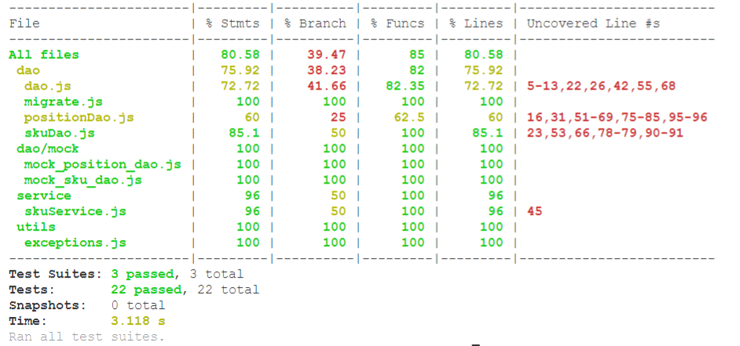
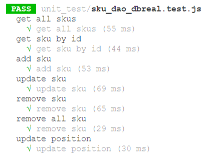
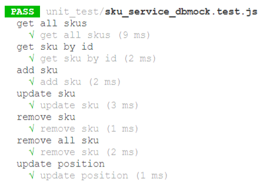
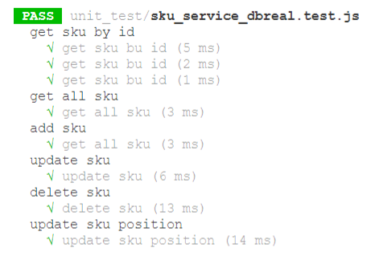

# Unit Testing Report

Date: 25/05/2022

Version: 1.0

# Contents

- [Black Box Unit Tests](#black-box-unit-tests)

- [White Box Unit Tests](#white-box-unit-tests)

# Black Box Unit Tests

    <Define here criteria, predicates and the combination of predicates for each function of each class.
    Define test cases to cover all equivalence classes and boundary conditions.
    In the table, report the description of the black box test case and (traceability) the correspondence with the Jest test case writing the
    class and method name that contains the test case>
    <Jest tests  must be in code/server/unit_test  >

- [Class SKU - method add](#class-sku-method-add)
- [Class SKU - method getById](#class-sku-method-getbyid)
- [Class SKU - method updateSku](#class-sku-method-updatesku)
- [Class SKU - method updatePosition](#class-sku-method-updateposition)
- [Class SKU - method remove](#class-sku-method-remove)

# Class SKU method add

    sku sku.add (String description, double weight, double volume, String notes, int price, int availableQuantity)

**Criteria for Description:**

- Check if Description is a String or not

**Predicates for Description:**

| Criteria     | Predicate        |
| ------------ | ---------------- |
| string Value | empty String     |
|              | not Empty String |
|              | undefined        |
|              | null             |
|              | not String       |

**Combination of predicates**:

| String Value | True / False | Description of the test case | Jest test case                         |
| ------------ | ------------ | ---------------------------- | -------------------------------------- |
| ""           | True         | SkuDao.add(..., "")          | sku_service_dbreal.test.js > "add sku" |
| "abc"        | True         | SkuDao.add(..., "abc")       | sku_service_dbreal.test.js > "add sku" |
| undefined    | False        | SkuDao.add(..., undefined)   | sku_service_dbreal.test.js > "add sku" |
| null         | False        | SkuDao.add(..., null )       | sku_service_dbreal.test.js > "add sku" |
| " "          | True         | SkuDao.add(..., " ")         | sku_service_dbreal.test.js > "add sku" |

**Criteria for weight:**

- Check if the input is a negative, zero number , not a number at all

**Predicates for weight:**

| Criteria    | Predicate       |
| ----------- | --------------- |
| Input Value | negative Number |
|             | Positive Number |
|             | Zero            |
|             | Not Number      |
|             | Float Number    |

**Boundaries**:

| Criteria    | Boundary values               |
| ----------- | ----------------------------- |
| Input Value | (Number.NEGATIVE_INFINITY,-1] |
| Input Value | (-1,0]                        |
| Input Value | (0, Number.POSITIVE_INFINITY) |
| Input Value | Not Number                    |

**Combination of predicates**:

| String Value | True / False | Description of the test case | Jest test case                         |
| ------------ | ------------ | ---------------------------- | -------------------------------------- |
| -1           | False        | SkuDao.add(..., -1 )         | sku_service_dbreal.test.js > "add sku" |
| "hi"         | False        | SkuDao.add(..., "hi")        | sku_service_dbreal.test.js > "add sku" |
| ' '          | False        | SkuDao.add(...,' ' )         | sku_service_dbreal.test.js > "add sku" |
| undefined    | False        | SkuDao.add(..., undefined )  | sku_service_dbreal.test.js > "add sku" |
| null         | False        | SkuDao.add(..., null )       | sku_service_dbreal.test.js > "add sku" |
| 12           | True         | SkuDao.add(..., 12 )         | sku_service_dbreal.test.js > "add sku" |
| 12.3         | True         | SkuDao.add(..., 12.3 )       | sku_service_dbreal.test.js > "add sku" |
| -12.2        | False        | SkuDao.add(..., -12.2 )      | sku_service_dbreal.test.js > "add sku" |

**Criteria for volume:**

- Check if the input is a negative number or not a number at all

**Predicates for volume:**

| Criteria    | Predicate       |
| ----------- | --------------- |
| Input Value | negative Number |
|             | Positive Number |
|             | Zero            |
|             | Not Number      |
|             | Float Number    |

**Boundaries**:

| Criteria    | Boundary values               |
| ----------- | ----------------------------- |
| Input Value | (Number.NEGATIVE_INFINITY,0)  |
| Input Value | (0, Number.POSITIVE_INFINITY) |
| Input Value | Not Number                    |

**Combination of predicates**:

| String Value | True / False | Description of the test case | Jest test case                         |
| ------------ | ------------ | ---------------------------- | -------------------------------------- |
| -1           | True         | SkuDao.add(..., -1 )         | sku_service_dbreal.test.js > "add sku" |
| "hi"         | True         | SkuDao.add(..., "hi" )       | sku_service_dbreal.test.js > "add sku" |
| ' '          | True         | SkuDao.add(..., ' ' )        | sku_service_dbreal.test.js > "add sku" |
| undefined    | True         | SkuDao.add(..., undefined)   | sku_service_dbreal.test.js > "add sku" |
| null         | True         | SkuDao.add(..., null)        | sku_service_dbreal.test.js > "add sku" |
| 12           | False        | SkuDao.add(..., 12)          | sku_service_dbreal.test.js > "add sku" |
| 12.3         | False        | SkuDao.add(..., 12.3 )       | sku_service_dbreal.test.js > "add sku" |
| -12.2        | True         | SkuDao.add(..., -12.2 )      | sku_service_dbreal.test.js > "add sku" |

**Criteria for notes:**

- Check if the Input is a String or not

**Predicates for notes:**

| Criteria     | Predicate        |
| ------------ | ---------------- |
| string Value | empty String     |
|              | not Empty String |
|              | undefined        |
|              | null             |
|              | not String       |

**Combination of predicates**:

| String Value | True / False | Description of the test case | Jest test case                         |
| ------------ | ------------ | ---------------------------- | -------------------------------------- |
| ""           | True         | SkuDao.add(..., "" )         | sku_service_dbreal.test.js > "add sku" |
| "abc"        | True         | SkuDao.aa(..., "abc")        | sku_service_dbreal.test.js > "add sku" |
| undefined    | False        | SkuDao.add(..., undefined )  | sku_service_dbreal.test.js > "add sku" |
| null         | False        | SkuDao.add(..., null )       | sku_service_dbreal.test.js > "add sku" |
| " "          | True         | SkuDao.add(..., " " )        | sku_service_dbreal.test.js > "add sku" |

**Criteria for price:**

- Check if the Input is not a Positive number

**Predicates for method price:**

| Criteria    | Predicate        |
| ----------- | ---------------- |
| Input Value | Positive Numbers |
|             | Negative Numbers |
|             | Not Number       |

**Combination of predicates**:

| Value     | False/True | Description of the test case | Jest test case                         |
| --------- | ---------- | ---------------------------- | -------------------------------------- |
| -1        | False      | SkuDao.price(..., -1)        | sku_service_dbreal.test.js > "add sku" |
| "Test"    | False      | SkuDao.price(..., "Test" )   | sku_service_dbreal.test.js > "add sku" |
| ' '       | False      | SkuDao.price(..., ' ' )      | sku_service_dbreal.test.js > "add sku" |
| Undefined | False      | SkuDao.price(..., Undefined) | sku_service_dbreal.test.js > "add sku" |
| null      | False      | SkuDao.price(..., null)      | sku_service_dbreal.test.js > "add sku" |
| 12        | True       | SkuDao.price(..., 12 )       | sku_service_dbreal.test.js > "add sku" |
| 12.3      | False      | SkuDao.price(..., 12.3 )     | sku_service_dbreal.test.js > "add sku" |
| -12.234   | False      | SkuDao.price(..., -12.234 )  | sku_service_dbreal.test.js > "add sku" |

**Criteria for AvailableQuantity:**

- Check if the Input is a positive number or not

**Predicates for method AvailableQuantity:**

| Criteria    | Predicate        |
| ----------- | ---------------- |
| Input Value | Positive Numbers |
|             | Negative Numbers |
|             | Not Number       |

**Combination of predicates**:

| Value     | True / False | Description of the test case | Jest test case                         |
| --------- | ------------ | ---------------------------- | -------------------------------------- |
| -1        | False        | SkuDao.add(..., -1 )         | sku_service_dbreal.test.js > "add sku" |
| "hi"      | False        | SkuDao.add(..., "hi")        | sku_service_dbreal.test.js > "add sku" |
| ' '       | False        | SkuDao.add(..., ' ')         | sku_service_dbreal.test.js > "add sku" |
| undefined | False        | SkuDao.add(..., undefined)   | sku_service_dbreal.test.js > "add sku" |
| null      | False        | SkuDao.add(..., null)        | sku_service_dbreal.test.js > "add sku" |
| 12        | True         | SkuDao.add(..., 12)          | sku_service_dbreal.test.js > "add sku" |
| 12.3      | False        | SkuDao.add(..., 12.3 )       | sku_service_dbreal.test.js > "add sku" |
| 0         | False        | SkuDao.add(..., 0)           | sku_service_dbreal.test.js > "add sku" |

# Class SKU method getbyid

    sku sku.getByid(int id)

**Criteria for id:**

- Check if the input is a negative, zero number , not a number at all

**Predicates for id:**

| Criteria    | Predicate       |
| ----------- | --------------- |
| Input Value | negative Number |
|             | Positive Number |
|             | Zero            |
|             | Not Number      |
|             | Float Number    |

**Combination of predicates**:

| Criteria    | Boundary values               |
| ----------- | ----------------------------- |
| Input Value | (Number.NEGATIVE_INFINITY,-1] |
| Input Value | (-1,0]                        |
| Input Value | (0, Number.POSITIVE_INFINITY) |
| Input Value | Not Number                    |

# Class SKU method remove

    void sku.remove = (int id)

- Check if the input is a negative, zero number , not a number at all

**Predicates for remove:**

| Criteria    | Predicate       |
| ----------- | --------------- |
| Input Value | negative Number |
|             | Positive Number |
|             | Zero            |
|             | Not Number      |
|             | Float Number    |

**Table for add method**:

| id  | description | weight | volume | notes | price | AvailableQuantity | valid |
| --- | ----------- | ------ | ------ | ----- | ----- | ----------------- | ----- |
| -3  | "abc"       | 65     | 76     | ""    | 54    | 24                | X     |
| 22  | undefined   | 30     | 15     | "asd" | 15    | 900               | X     |
| 4   | ""          | -12    | 12.3   | ""    | 22    | 1                 | X     |
| 4   | ""          | 12     | -12.3  | "as"  | 22    | 12                | X     |
| 4   | ""          | -12    | 12.3   | null  | 34    | 100               | X     |
| 4   | ""          | -12    | 12.3   | ""    | 22.6  | 1                 | X     |
| 4   | ""          | -12    | 12.3   | ""    | 22    | 0                 | X     |
| 3   | "abc"       | 65     | 76     | ""    | 54    | 24                | V     |

# Class SKU method updatesku

    void sku.updateSku = (int id, String newDescription, double newWeight, double newVolume, String newNotes, int newPrice, int newAvailableQuantity)

**Criteria for newDescription:**

- Check if newDescription is a String or not

**Predicates for newDescription:**

| Criteria     | Predicate        |
| ------------ | ---------------- |
| string Value | empty String     |
|              | not Empty String |
|              | undefined        |
|              | null             |
|              | not String       |

**Combination of predicates**:

| String Value | True / False | Description of the test case      | Jest test case                            |
| ------------ | ------------ | --------------------------------- | ----------------------------------------- |
| ""           | True         | SkuDao.updateSku(..., "" )        | sku_service_dbreal.test.js > "update sku" |
| "abc"        | True         | SkuDao.updateSku(..., "abc" )     | sku_service_dbreal.test.js > "update sku" |
| undefined    | False        | SkuDao.updateSku(..., undefined ) | sku_service_dbreal.test.js > "update sku" |
| null         | False        | SkuDao.updateSku(..., null )      | sku_service_dbreal.test.js > "update sku" |
| " "          | True         | SkuDao.updateSku(..., " " )       | sku_service_dbreal.test.js > "update sku" |

**Criteria for id:**

- Check if the input is a negative, zero number , not a number at all

**Predicates for id:**

| Criteria    | Predicate       |
| ----------- | --------------- |
| Input Value | negative Number |
|             | Positive Number |
|             | Zero            |
|             | Not Number      |
|             | Float Number    |

**Boundaries**:

| Criteria    | Boundary values               |
| ----------- | ----------------------------- |
| Input Value | (Number.NEGATIVE_INFINITY,-1] |
| Input Value | (-1,0]                        |
| Input Value | (0, Number.POSITIVE_INFINITY) |
| Input Value | Not Number                    |

**Combination of predicates**:

| Value     | True / False | Description of the test case       | Jest test case                            |
| --------- | ------------ | ---------------------------------- | ----------------------------------------- |
| -1        | False        | SkuDao.updateSku (-1, ...)         | sku_service_dbreal.test.js > "update sku" |
| 12        | True         | SkuDao.updateSku (12, ...)         | sku_service_dbreal.test.js > "update sku" |
| 12.4      | False        | SkuDao.updateSku (12.4 , ...)      | sku_service_dbreal.test.js > "update sku" |
| -1.4      | False        | SkuDao.updateSku (-1.4 , ...)      | sku_service_dbreal.test.js > "update sku" |
| 0         | False        | SkuDao.updateSku (0, ...)          | sku_service_dbreal.test.js > "update sku" |
| "hi"      | False        | SkuDao.updateSku ("hi", ...)       | sku_service_dbreal.test.js > "update sku" |
| ' '       | False        | SkuDao.updateSku (' ', ...)        | sku_service_dbreal.test.js > "update sku" |
| undefined | False        | SkuDao.updateSku (undefined , ...) | sku_service_dbreal.test.js > "update sku" |
| null      | False        | SkuDao.updateSku (null, ...)       | sku_service_dbreal.test.js > "update sku" |

**Criteria for newWeight:**

- Check if the input is a negative number or not a number at all

**Predicates for newWeight:**

| Criteria    | Predicate       |
| ----------- | --------------- |
| Input Value | negative Number |
|             | Positive Number |
|             | Zero            |
|             | Not Number      |
|             | Float Number    |

**Boundaries**:

| Criteria    | Boundary values               |
| ----------- | ----------------------------- |
| Input Value | (Number.NEGATIVE_INFINITY,-1] |
| Input Value | (-1,0]                        |
| Input Value | (0, Number.POSITIVE_INFINITY) |
| Input Value | Not Number                    |

**Combination of predicates**:

| String Value | True / False | Description of the test case     | Jest test case                            |
| ------------ | ------------ | -------------------------------- | ----------------------------------------- |
| -1           | False        | SkuDao.updateSku(..., -1)        | sku_service_dbreal.test.js > "update sku" |
| "hi"         | False        | SkuDao.updateSku(..., "hi")      | sku_service_dbreal.test.js > "update sku" |
| ' '          | False        | SkuDao.updateSku(..., ' ' )      | sku_service_dbreal.test.js > "update sku" |
| undefined    | False        | SkuDao.updateSku(..., undefined) | sku_service_dbreal.test.js > "update sku" |
| null         | False        | SkuDao.updateSku(..., null)      | sku_service_dbreal.test.js > "update sku" |
| 12           | True         | SkuDao.updateSku(..., 12 )       | sku_service_dbreal.test.js > "update sku" |
| 12.3         | True         | SkuDao.updateSku(..., 12.3)      | sku_service_dbreal.test.js > "update sku" |
| -12.2        | False        | SkuDao.updateSku(..., -12.2)     | sku_service_dbreal.test.js > "update sku" |

**Criteria for newVolume:**

- Check if the input is a negative number or not a number at all

**Predicates for newVolume:**

| Criteria    | Predicate       |
| ----------- | --------------- |
| Input Value | negative Number |
|             | Positive Number |
|             | Zero            |
|             | Not Number      |
|             | Float Number    |

**Boundaries**:

| Criteria    | Boundary values               |
| ----------- | ----------------------------- |
| Input Value | (Number.NEGATIVE_INFINITY,-1] |
| Input Value | (-1,0]                        |
| Input Value | (0, Number.POSITIVE_INFINITY) |
| Input Value | Not Number                    |

**Combination of predicates**:

| Value     | True / False | Description of the test case      | Jest test case                            |
| --------- | ------------ | --------------------------------- | ----------------------------------------- |
| -1        | False        | SkuDao.updateSku(..., -1 )        | sku_service_dbreal.test.js > "update sku" |
| "hi"      | False        | SkuDao.updateSku(..., "hi")       | sku_service_dbreal.test.js > "update sku" |
| ' '       | False        | SkuDao.updateSku(..., ' ' )       | sku_service_dbreal.test.js > "update sku" |
| undefined | False        | SkuDao.updateSku(..., undefined ) | sku_service_dbreal.test.js > "update sku" |
| null      | False        | SkuDao.updateSku(..., null )      | sku_service_dbreal.test.js > "update sku" |
| 12        | True         | SkuDao.updateSku(..., 12 )        | sku_service_dbreal.test.js > "update sku" |
| 12.3      | True         | SkuDao.updateSku(..., 12.3 )      | sku_service_dbreal.test.js > "update sku" |
| -12.2     | False        | SkuDao.updateSku(..., -12.2 )     | sku_service_dbreal.test.js > "update sku" |

**Criteria for newNotes:**

- Check if the Input is a String or not

**Predicates for newNotes:**

| Criteria     | Predicate        |
| ------------ | ---------------- |
| string Value | empty String     |
|              | not Empty String |
|              | undefined        |
|              | null             |
|              | not String       |

**Combination of predicates**:

| String Value | True / False | Description of the test case      | Jest test case                            |
| ------------ | ------------ | --------------------------------- | ----------------------------------------- |
| ""           | True         | SkuDao.updateSku(..., "" )        | sku_service_dbreal.test.js > "update sku" |
| "abc"        | True         | SkuDao.updateSku(..., "abc" )     | sku_service_dbreal.test.js > "update sku" |
| undefined    | False        | SkuDao.updateSku(..., undefined ) | sku_service_dbreal.test.js > "update sku" |
| null         | False        | SkuDao.updateSku(..., null)       | sku_service_dbreal.test.js > "update sku" |
| " "          | True         | SkuDao.updateSku(..., " " )       | sku_service_dbreal.test.js > "update sku" |

**Criteria for newPrice:**

- Check if the Input is not a Positive number

**Predicates for method newPrice:**

| Criteria    | Predicate        |
| ----------- | ---------------- |
| Input Value | Positive Numbers |
|             | Negative Numbers |
|             | Not Number       |

**Combination of predicates**:

| Value     | False/True | Description of the test case     | Jest test case                            |
| --------- | ---------- | -------------------------------- | ----------------------------------------- |
| -1        | False      | SkuDao.updateSku(..., -1 )       | sku_service_dbreal.test.js > "update sku" |
| "Test"    | False      | SkuDao.updateSku(..., "Test")    | sku_service_dbreal.test.js > "update sku" |
| ' '       | False      | SkuDao.updateSku(..., ' ' )      | sku_service_dbreal.test.js > "update sku" |
| Undefined | False      | SkuDao.updateSku(..., Undefined) | sku_service_dbreal.test.js > "update sku" |
| null      | False      | SkuDao.updateSku(..., null)      | sku_service_dbreal.test.js > "update sku" |
| 12        | True       | SkuDao.updateSku(..., 12 )       | sku_service_dbreal.test.js > "update sku" |
| 12.3      | False      | SkuDao.updateSku(..., 12.3 )     | sku_service_dbreal.test.js > "update sku" |
| -12.234   | False      | SkuDao.updateSku(..., -12.234)   | sku_service_dbreal.test.js > "update sku" |

**Criteria for newAvailableQuantity:**

- Check if the Input is a positive number or not

**Predicates for method newAvailableQuantity:**

| Criteria    | Predicate        |
| ----------- | ---------------- |
| Input Value | Positive Numbers |
|             | Negative Numbers |
|             | Not Number       |

**Combination of predicates**:

| Value     | True / False | Description of the test case      | Jest test case                            |
| --------- | ------------ | --------------------------------- | ----------------------------------------- |
| -1        | False        | SkuDao.updateSku(..., -1 )        | sku_service_dbreal.test.js > "update sku" |
| "hi"      | False        | SkuDao.updateSku(..., "hi" )      | sku_service_dbreal.test.js > "update sku" |
| ' '       | False        | SkuDao.updateSku(..., ' ')        | sku_service_dbreal.test.js > "update sku" |
| undefined | False        | SkuDao.updateSku(..., undefined ) | sku_service_dbreal.test.js > "update sku" |
| null      | False        | SkuDao.updateSku(..., null )      | sku_service_dbreal.test.js > "update sku" |
| 12        | True         | SkuDao.updateSku(..., 12)         | sku_service_dbreal.test.js > "update sku" |
| 12.3      | False        | SkuDao.updateSku(..., 12.3 )      | sku_service_dbreal.test.js > "update sku" |
| 0         | True         | SkuDao.updateSku(..., 0 )         | sku_service_dbreal.test.js > "update sku" |

# Class SKU method updateposition

    void sku.updatePosition = (int id, String newPosition)

**Criteria for id:**

- Check if the input is a negative, zero number , not a number at all

**Predicates for id:**

| Criteria    | Predicate       |
| ----------- | --------------- |
| Input Value | negative Number |
|             | Positive Number |
|             | Zero            |
|             | Not Number      |
|             | Float Number    |

**Boundaries**:

| Criteria    | Boundary values               |
| ----------- | ----------------------------- |
| Input Value | (Number.NEGATIVE_INFINITY,-1] |
| Input Value | (-1,0]                        |
| Input Value | (0, Number.POSITIVE_INFINITY) |
| Input Value | Not Number                    |

**Combination of predicates**:

| Value     | True / False | Description of the test case       | Jest test case                                     |
| --------- | ------------ | ---------------------------------- | -------------------------------------------------- |
| -1        | False        | SkuDao.updateSku (-1, ...)         | sku_service_dbreal.test.js > "update sku position" |
| 12        | True         | SkuDao.updateSku (12, ...)         | sku_service_dbreal.test.js > "update sku position" |
| 12.4      | False        | SkuDao.updateSku (12.4 , ...)      | sku_service_dbreal.test.js > "update sku position" |
| -1.4      | False        | SkuDao.updateSku (-1.4 , ...)      | sku_service_dbreal.test.js > "update sku position" |
| 0         | True         | SkuDao.updateSku ( 0 , ...)        | sku_service_dbreal.test.js > "update sku position" |
| "hi"      | False        | SkuDao.updateSku ("hi" , ...)      | sku_service_dbreal.test.js > "update sku position" |
| ' '       | False        | SkuDao.updateSku (' ' , ...)       | sku_service_dbreal.test.js > "update sku position" |
| undefined | False        | SkuDao.updateSku ( undefined, ...) | sku_service_dbreal.test.js > "update sku position" |
| null      | False        | SkuDao.updateSku (null , ...)      | sku_service_dbreal.test.js > "update sku position" |

**Criteria for newPosition:**

- Check if newPosition is a String or not

**Predicates for newPosition:**

| Criteria     | Predicate        |
| ------------ | ---------------- |
| string Value | empty String     |
|              | not Empty String |
|              | undefined        |
|              | null             |
|              | not String       |

**Combination of predicates**:

| String Value | True / False | Description of the test case             | Jest test case  |
| ------------ | ------------ | ---------------------------------------- | --------------- |
| ""           | False        | SkuDao.updatePosition (..., "" ) | sku_service_dbreal.test.js > "update sku position" |
| "abc"        | True         | SkuDao.updatePosition (..., "abc") | sku_service_dbreal.test.js > "update sku position" |
| undefined    | False        | SkuDao.updatePosition (..., undefined ) | sku_service_dbreal.test.js > "update sku position" |
| null         | False        | SkuDao.updatePosition (..., null ) | sku_service_dbreal.test.js > "update sku position" |
| " "          | False        | SkuDao.updatePosition (..., " ") | sku_service_dbreal.test.js > "update sku position" |

**Table for updateSku**:

| id  | newDescription | newWeight | newVolume | newNotes | newPrice | newAvailableQuantity | valid |
| --- | -------------- | --------- | --------- | -------- | -------- | -------------------- | ----- |
| -3  | "abc"          | 65        | 76        | ""       | 54       | 24                   | X     |
| 22  | undefined      | 30        | 15        | "asd"    | 15       | 900                  | X     |
| 4   | ""             | -12       | 12.3      | ""       | 22       | 1                    | X     |
| 4   | ""             | 12        | -12.3     | "as"     | 22       | 12                   | X     |
| 4   | ""             | -12       | 12.3      | null     | 34       | 100                  | X     |
| 4   | ""             | -12       | 12.3      | ""       | 22.6     | 1                    | X     |
| 4   | ""             | -12       | 12.3      | ""       | 22       | 0                    | X     |
| 3   | "abc"          | 65        | 76        | ""       | 54       | 24                   | V     |

**Table for updatePosition**:
| id | position | valid |
|----|------------|---------|
| -4 | "asdfa" | X |
| 2 | null | X |
| 2 | "position" | V |  
| 3 | "" | X |  
| 0 | "asd" | X |

# White Box Unit Tests

### Test cases definition

#### InternalOrder database check

| Unit name        | Jest test case                  |
| ---------------- | ------------------------------- |
| InternalOrderDAO | createInternalOrder             |
| InternalOrderDAO | getAccepted                     |
| InternalOrderDAO | addSkuItemToInternalOrderIntoDB |
| InternalOrderDAO | removeInternalOrderFromDB       |
| InternalOrderDAO | getIssued                       |

#### Item database check

| Unit name   | Jest test case      |
| ----------- | ------------------- |
| testItemDAO | delete item from db |
| testItemDAO | testNewItem()       |

#### Position database check

| Unit name       | Jest test case          |
| --------------- | ----------------------- |
| testPositionDao | delete position from db |
| testPositionDao | testNewPosition ()      |
| testPositionDao | testModifyPosition()    |
| testPositionDao | testGetPositionById()   |

#### RestockOrder database check

| Unit name    | Jest test case                 |
| ------------ | ------------------------------ |
| RestockOrder | createNewRestockOrderIntoDb    |
| RestockOrder | addSkuItemToRestockOrderIntoDB |
| RestockOrder | get restock order by id        |
| RestockOrder | add transport note             |
| RestockOrder | delete restock order from db   |

#### SkuDAO database check

| Unit name | Jest test case     |
| --------- | ------------------ |
| SkuDAO    | delete Sku from db |
| SkuDAO    | create new sku     |

#### SkuItemDAO database check

| Unit name  | Jest test case         |
| ---------- | ---------------------- |
| SkuItemDAO | delete SkuItem from db |
| SkuItemDAO | testNewSkuItem()       |

#### TestDescriptorDAO database check

| Unit name         | Jest test case                 |
| ----------------- | ------------------------------ |
| TestDescriptorDAO | testCreateTestDescriptor()     |
| TestDescriptorDAO | testGetAllTestDescriptors()    |
| TestDescriptorDAO | testGetOneTestDescriptor()     |
| TestDescriptorDAO | testDeleteTestDescriptorById() |
| TestDescriptorDAO | delete testDescriptor from db  |

#### TestResultDAO database check

| Unit name     | Jest test case            |
| ------------- | ------------------------- |
| TestResultDAO | delete testResult from db |
| TestResultDAO | modify a test result      |

#### UserDAO database check

| Unit name    | Jest test case      |
| ------------ | ------------------- |
| Test UserDAO | delete user from db |

### Code coverage report

### Loop coverage analysis

| Unit name         | Loop rows | Number of iterations | Jest test case              |
| ----------------- | --------- | -------------------- | --------------------------- |
| SkuService.getAll | 3         | 1                    | integration with the skuDao |
| SkuService.getById | 3         | 1                    | integration with the skuDao |
| SkuService.addSku | 3         | 1                    | integration with the skuDao |
| SkuService.updateSku | 3         | 1                    | integration with the skuDao |
| SkuService.updatePosition | 3         | 1                    | integration with the skuDao |
| SkuService.delete | 3         | 1                    | integration with the skuDao |

